# RAFlow - 实时语音交互系统详细设计文档

> 基于 Tauri v2 与 ElevenLabs Scribe v2 的桌面语音听写应用
>
> 版本: 1.0.0
> 日期: 2025-11-22

---

## 目录

1. [系统概述](#1-系统概述)
2. [技术栈版本说明](#2-技术栈版本说明)
3. [系统架构设计](#3-系统架构设计)
4. [核心模块设计](#4-核心模块设计)
5. [数据流设计](#5-数据流设计)
6. [状态管理设计](#6-状态管理设计)
7. [网络通信设计](#7-网络通信设计)
8. [音频处理管道设计](#8-音频处理管道设计)
9. [文本注入策略设计](#9-文本注入策略设计)
10. [UI/UX 设计](#10-uiux-设计)
11. [性能优化策略](#11-性能优化策略)
12. [安全性设计](#12-安全性设计)
13. [部署与打包](#13-部署与打包)
14. [参考资源](#14-参考资源)

---

## 1. 系统概述

### 1.1 项目定位

RAFlow (Realtime Audio Flow) 是一个类似 [Wispr Flow](https://www.wsprlabs.com/) 的桌面级实时语音听写工具，通过全局热键唤醒，实现"说话即上屏"的流畅体验。应用常驻后台系统托盘，对系统资源占用极低，能够无缝集成到用户的日常工作流中。

### 1.2 核心特性

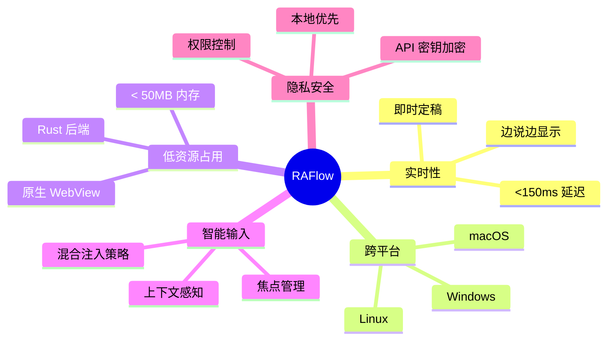
```mermaid
mindmap
  root((RAFlow))
    实时性
      <150ms 延迟
      边说边显示
      即时定稿
    跨平台
      macOS
      Windows
      Linux
    低资源占用
      < 50MB 内存
      Rust 后端
      原生 WebView
    智能输入
      上下文感知
      混合注入策略
      焦点管理
    隐私安全
      本地优先
      权限控制
      API 密钥加密
```

### 1.3 系统边界

**范围内：**
- 实时语音转文本（STT）
- 全局热键触发
- 多应用文本注入
- 系统托盘常驻
- 本地配置管理

**范围外：**
- 文本转语音（TTS）
- 离线语音识别（未来版本）
- 云端同步
- 多用户管理

---

## 2. 技术栈版本说明

基于 2024-2025 年最新稳定版本的技术选型：

### 2.1 核心框架

| 组件        | 版本    | 说明                                                                                      | 参考                                                     |
|-------------|---------|-----------------------------------------------------------------------------------------|----------------------------------------------------------|
| **Tauri**   | 2.1.0+  | [Tauri 2.0](https://v2.tauri.app/blog/tauri-20/) 于 2024 年发布，引入移动端支持、增强安全性 | [Tauri 2.0 Release](https://v2.tauri.app/blog/tauri-20/) |
| **Rust**    | 1.77.2+ | Tauri v2 要求的最低版本                                                                   | [Tauri Docs](https://v2.tauri.app/)                      |
| **Node.js** | 18+ LTS | 前端构建工具链                                                                            | -                                                        |

### 2.2 Rust 依赖项（最新版本）

```toml
[package]
name = "raflow-core"
version = "0.1.0"
edition = "2024"
rust-version = "1.90"

[dependencies]
# Tauri 核心生态
tauri = { version = "2.1", features = ["tray-icon", "protocol-asset"] }
tauri-plugin-global-shortcut = "2.3.0"  # 最新: 2024-08
tauri-plugin-clipboard-manager = "2.1"
tauri-plugin-dialog = "2.1"
tauri-plugin-fs = "2.1"
tauri-plugin-store = "2.1"  # 用于配置持久化

# 异步运行时与网络
tokio = { version = "1.40", features = ["full"] }
tokio-tungstenite = { version = "0.24", features = ["rustls-tls-native-roots"] }
futures-util = "0.3"
serde = { version = "1.0", features = ["derive"] }
serde_json = "1.0"

# 音频处理
cpal = "0.16"  # 最新: 2025-06
rubato = "0.16.2"  # 最新: 2024-06

# 系统底层交互
enigo = "0.6.1"  # 最新: 2024-08，支持 Rust 2024 edition
active-win-pos-rs = "0.9"

# macOS 专用
[target.'cfg(target_os = "macos")'.dependencies]
objc = "0.2"
cocoa = "0.25"
core-foundation = "0.9"
macos-app-nap = "0.1"  # 防止 App Nap

# 工具库
anyhow = "1.0"
thiserror = "1.0"
tracing = { version = "0.1", features = ["log"] }
tracing-subscriber = "0.3"
base64 = "0.22"
```

**版本说明：**

- **cpal 0.16.0**: 2025 年 6 月最新版本，[支持 ASIO](https://github.com/RustAudio/cpal) 并改进了跨平台音频 I/O
- **tokio-tungstenite 0.24**: [高性能版本](https://lib.rs/crates/tokio-tungstenite)，相比旧版本性能显著提升
- **enigo 0.6.1**: [2024 年 8 月更新](https://lib.rs/crates/enigo)，采用 Rust 2024 edition，改用 x11rb
- **rubato 0.16.2**: [支持 SIMD 加速](https://github.com/HEnquist/rubato)的高质量重采样库
- **tauri-plugin-global-shortcut 2.3.0**: [Tauri v2 官方插件](https://v2.tauri.app/plugin/global-shortcut/)最新版本

### 2.3 前端技术栈

```json
{
  "dependencies": {
    "@tauri-apps/api": "^2.1.0",
    "@tauri-apps/plugin-global-shortcut": "^2.3.0",
    "@tauri-apps/plugin-clipboard-manager": "^2.1.0",
    "react": "^19.20",
    "react-dom": "^19.2.0",
    "zustand": "^5.0.8",
    "tailwindcss": "^4.1.17"
  }
}
```

### 2.4 外部 API

| 服务                              | 版本 | 说明                                                                       | 参考                                                                                                           |
|-----------------------------------|------|----------------------------------------------------------------------------|----------------------------------------------------------------------------------------------------------------|
| **ElevenLabs Scribe v2 Realtime** | v2   | [~150ms 延迟](https://elevenlabs.io/realtime-speech-to-text)，支持 92+ 语言 | [Scribe v2 Documentation](https://elevenlabs.io/docs/api-reference/speech-to-text/v-1-speech-to-text-realtime) |
| **WebSocket 端点**                | -    | `wss://api.elevenlabs.io/v1/speech-to-text/realtime`                       | [API Reference](https://elevenlabs.io/docs/cookbooks/speech-to-text/streaming)                                 |

---

## 3. 系统架构设计

### 3.1 整体架构

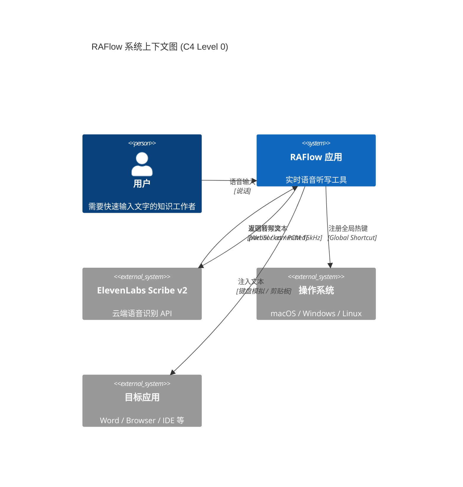
```mermaid
C4Context
    title RAFlow 系统上下文图 (C4 Level 0)

    Person(user, "用户", "需要快速输入文字的知识工作者")

    System(raflow, "RAFlow 应用", "实时语音听写工具")

    System_Ext(elevenlabs, "ElevenLabs Scribe v2", "云端语音识别 API")
    System_Ext(os, "操作系统", "macOS / Windows / Linux")
    System_Ext(target_app, "目标应用", "Word / Browser / IDE 等")

    Rel(user, raflow, "按热键唤醒", "Cmd+Shift+\\")
    Rel(user, raflow, "语音输入", "说话")

    Rel(raflow, elevenlabs, "发送音频流", "WebSocket / PCM 16kHz")
    Rel(elevenlabs, raflow, "返回转写文本", "partial / committed")

    Rel(raflow, os, "获取活跃窗口", "Accessibility API")
    Rel(raflow, os, "注册全局热键", "Global Shortcut")
    Rel(raflow, target_app, "注入文本", "键盘模拟 / 剪贴板")

    UpdateLayoutConfig($c4ShapeInRow="3", $c4BoundaryInRow="1")
```

### 3.2 容器架构（C4 Level 1）

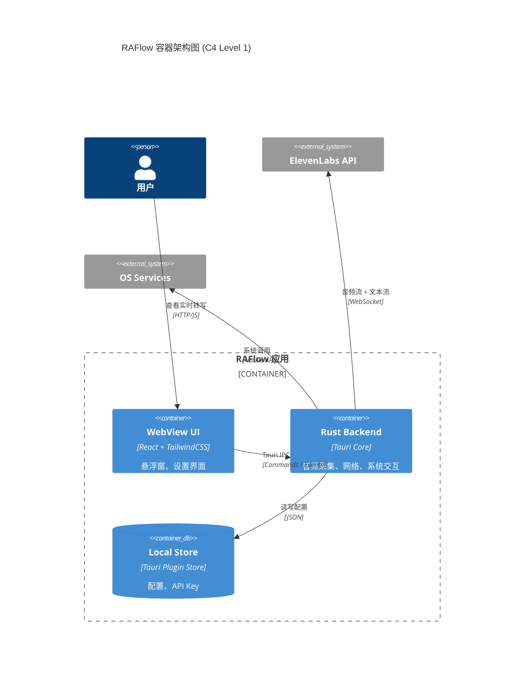
```mermaid
C4Container
    title RAFlow 容器架构图 (C4 Level 1)

    Person(user, "用户")

    Container_Boundary(raflow_app, "RAFlow 应用") {
        Container(webview, "WebView UI", "React + TailwindCSS", "悬浮窗、设置界面")
        Container(rust_backend, "Rust Backend", "Tauri Core", "音频采集、网络、系统交互")
        ContainerDb(local_store, "Local Store", "Tauri Plugin Store", "配置、API Key")
    }

    System_Ext(elevenlabs_api, "ElevenLabs API")
    System_Ext(os_services, "OS Services")

    Rel(user, webview, "查看实时转写", "HTTP/JS")
    Rel(webview, rust_backend, "Tauri IPC", "Commands / Events")
    Rel(rust_backend, local_store, "读写配置", "JSON")

    Rel(rust_backend, elevenlabs_api, "音频流 + 文本流", "WebSocket")
    Rel(rust_backend, os_services, "系统调用", "Native API")

    UpdateLayoutConfig($c4ShapeInRow="2", $c4BoundaryInRow="1")
```

### 3.3 Tauri 进程架构

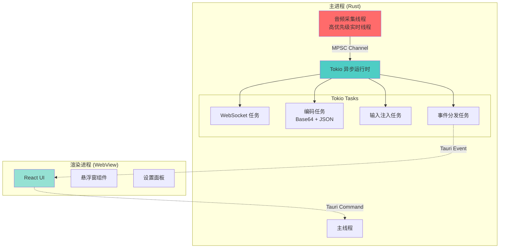
```mermaid
graph TB
    subgraph "主进程 (Rust)"
        Main[主线程]
        AudioThread[音频采集线程<br/>高优先级实时线程]
        TokioRuntime[Tokio 异步运行时]

        subgraph "Tokio Tasks"
            WSTask[WebSocket 任务]
            EncodeTask[编码任务<br/>Base64 + JSON]
            InputTask[输入注入任务]
            EventTask[事件分发任务]
        end
    end

    subgraph "渲染进程 (WebView)"
        React[React UI]
        Overlay[悬浮窗组件]
        Settings[设置面板]
    end

    AudioThread -->|MPSC Channel| TokioRuntime
    TokioRuntime --> WSTask
    TokioRuntime --> EncodeTask
    TokioRuntime --> InputTask
    TokioRuntime --> EventTask

    EventTask -.->|Tauri Event| React
    React -.->|Tauri Command| Main

    style AudioThread fill:#ff6b6b
    style TokioRuntime fill:#4ecdc4
    style React fill:#95e1d3
```

**关键设计决策：**

1. **线程隔离**：音频线程与 Tokio 运行时完全隔离，通过无锁通道传递数据
2. **异步优先**：所有 I/O 操作（网络、系统调用）都在 Tokio 运行时中异步执行
3. **单向数据流**：前端只接收事件，不直接操作音频/网络状态

---

## 4. 核心模块设计

### 4.1 模块划分

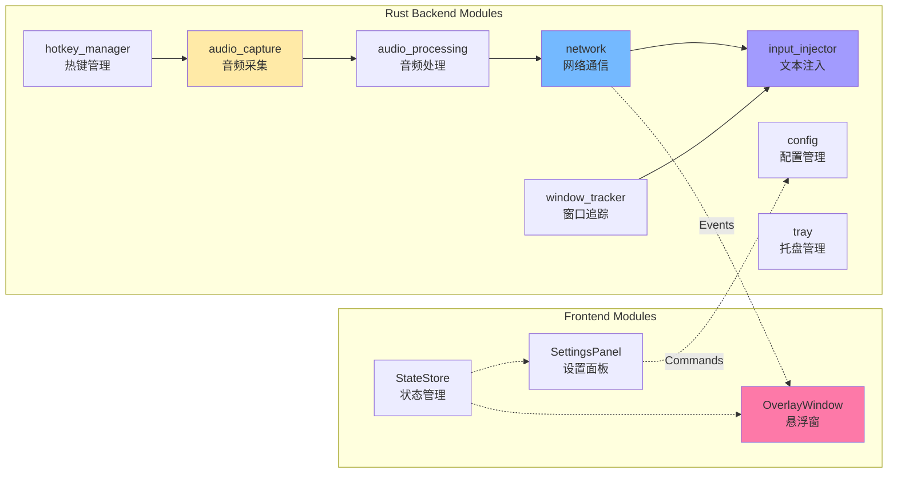
```mermaid
graph LR
    subgraph "Rust Backend Modules"
        A[audio_capture<br/>音频采集]
        B[audio_processing<br/>音频处理]
        C[network<br/>网络通信]
        D[input_injector<br/>文本注入]
        E[hotkey_manager<br/>热键管理]
        F[window_tracker<br/>窗口追踪]
        G[config<br/>配置管理]
        H[tray<br/>托盘管理]
    end

    subgraph "Frontend Modules"
        I[OverlayWindow<br/>悬浮窗]
        J[SettingsPanel<br/>设置面板]
        K[StateStore<br/>状态管理]
    end

    A --> B
    B --> C
    C --> D
    E --> A
    F --> D

    C -.->|Events| I
    J -.->|Commands| G
    K -.-> I
    K -.-> J

    style A fill:#ffeaa7
    style C fill:#74b9ff
    style D fill:#a29bfe
    style I fill:#fd79a8
```

### 4.2 模块职责矩阵

| 模块               | 职责                          | 依赖                           | 输出             |
|--------------------|-----------------------------|--------------------------------|------------------|
| `audio_capture`    | 枚举设备、启动 cpal 音频流     | `cpal`                         | `f32` 音频样本流 |
| `audio_processing` | 重采样（48kHz→16kHz）、音量计算  | `rubato`                       | `i16` PCM 数据   |
| `network`          | WebSocket 连接管理、消息序列化 | `tokio-tungstenite`            | 转写事件         |
| `input_injector`   | 键盘模拟、剪贴板操作、焦点管理  | `enigo`, `clipboard`           | -                |
| `hotkey_manager`   | 注册全局热键、事件监听         | `tauri-plugin-global-shortcut` | 热键事件         |
| `window_tracker`   | 获取当前活跃窗口信息          | `active-win-pos-rs`            | 窗口元数据       |
| `config`           | 读写配置文件、密钥加密         | `tauri-plugin-store`           | 配置对象         |
| `tray`             | 系统托盘图标、菜单管理         | `tauri::tray`                  | 托盘事件         |

### 4.3 代码组织结构

```
src-tauri/
├── src/
│   ├── main.rs                 # 应用入口
│   ├── lib.rs                  # Tauri Builder 配置
│   ├── audio/
│   │   ├── mod.rs
│   │   ├── capture.rs          # cpal 音频采集
│   │   ├── resampler.rs        # rubato 重采样器
│   │   └── buffer.rs           # 环形缓冲区
│   ├── network/
│   │   ├── mod.rs
│   │   ├── client.rs           # WebSocket 客户端
│   │   ├── protocol.rs         # Scribe v2 协议
│   │   └── state_machine.rs   # 连接状态机
│   ├── input/
│   │   ├── mod.rs
│   │   ├── injector.rs         # 文本注入策略
│   │   ├── keyboard.rs         # enigo 键盘模拟
│   │   └── clipboard.rs        # 剪贴板操作
│   ├── system/
│   │   ├── mod.rs
│   │   ├── hotkey.rs           # 全局热键
│   │   ├── window.rs           # 活跃窗口追踪
│   │   └── permissions.rs      # macOS 权限检查
│   ├── ui/
│   │   ├── mod.rs
│   │   ├── tray.rs             # 系统托盘
│   │   └── commands.rs         # Tauri Commands
│   ├── config/
│   │   ├── mod.rs
│   │   └── store.rs            # 配置持久化
│   └── utils/
│       ├── mod.rs
│       ├── logger.rs           # 日志配置
│       └── crypto.rs           # API Key 加密
├── Cargo.toml
└── tauri.conf.json
```

---

## 5. 数据流设计

### 5.1 音频数据流

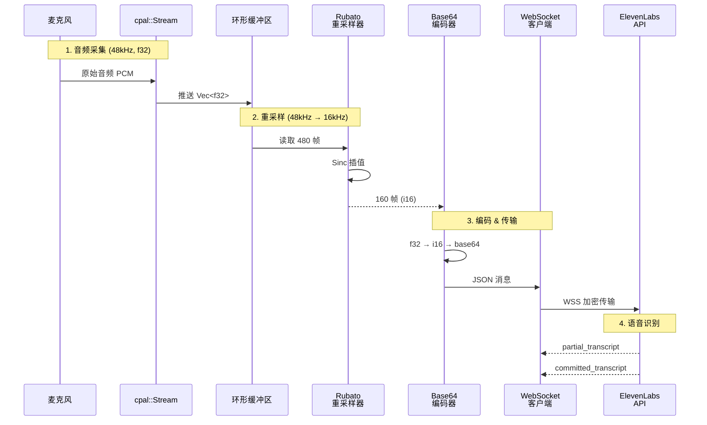
```mermaid
sequenceDiagram
    participant Mic as 麦克风
    participant CPAL as cpal::Stream
    participant RingBuf as 环形缓冲区
    participant Resampler as Rubato<br/>重采样器
    participant Encoder as Base64<br/>编码器
    participant WS as WebSocket<br/>客户端
    participant API as ElevenLabs<br/>API

    Note over Mic,CPAL: 1. 音频采集 (48kHz, f32)
    Mic->>CPAL: 原始音频 PCM
    CPAL->>RingBuf: 推送 Vec<f32>

    Note over RingBuf,Resampler: 2. 重采样 (48kHz → 16kHz)
    RingBuf->>Resampler: 读取 480 帧
    Resampler->>Resampler: Sinc 插值
    Resampler-->>Encoder: 160 帧 (i16)

    Note over Encoder,WS: 3. 编码 & 传输
    Encoder->>Encoder: f32 → i16 → base64
    Encoder->>WS: JSON 消息
    WS->>API: WSS 加密传输

    Note over API: 4. 语音识别
    API-->>WS: partial_transcript
    API-->>WS: committed_transcript
```

**性能优化点：**

1. **零拷贝设计**：`RingBuf` 使用 `crossbeam::queue::ArrayQueue` 避免内存分配
2. **批量处理**：累积 100ms 数据（1600 采样点 @ 16kHz）后再发送，减少网络开销
3. **SIMD 加速**：`rubato` 在 x86_64 和 aarch64 上自动启用 SIMD

### 5.2 文本数据流

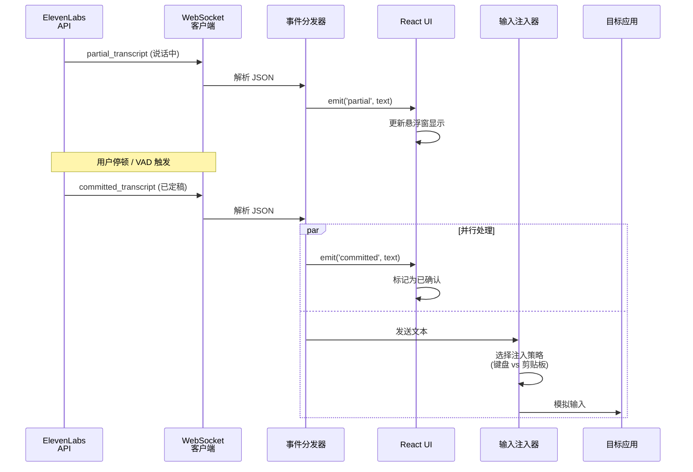
```mermaid
sequenceDiagram
    participant API as ElevenLabs<br/>API
    participant WS as WebSocket<br/>客户端
    participant Dispatcher as 事件分发器
    participant UI as React UI
    participant Injector as 输入注入器
    participant TargetApp as 目标应用

    API->>WS: partial_transcript (说话中)
    WS->>Dispatcher: 解析 JSON
    Dispatcher->>UI: emit('partial', text)
    UI->>UI: 更新悬浮窗显示

    Note over API,WS: 用户停顿 / VAD 触发
    API->>WS: committed_transcript (已定稿)
    WS->>Dispatcher: 解析 JSON

    par 并行处理
        Dispatcher->>UI: emit('committed', text)
        UI->>UI: 标记为已确认
    and
        Dispatcher->>Injector: 发送文本
        Injector->>Injector: 选择注入策略<br/>(键盘 vs 剪贴板)
        Injector->>TargetApp: 模拟输入
    end
```

### 5.3 配置数据流

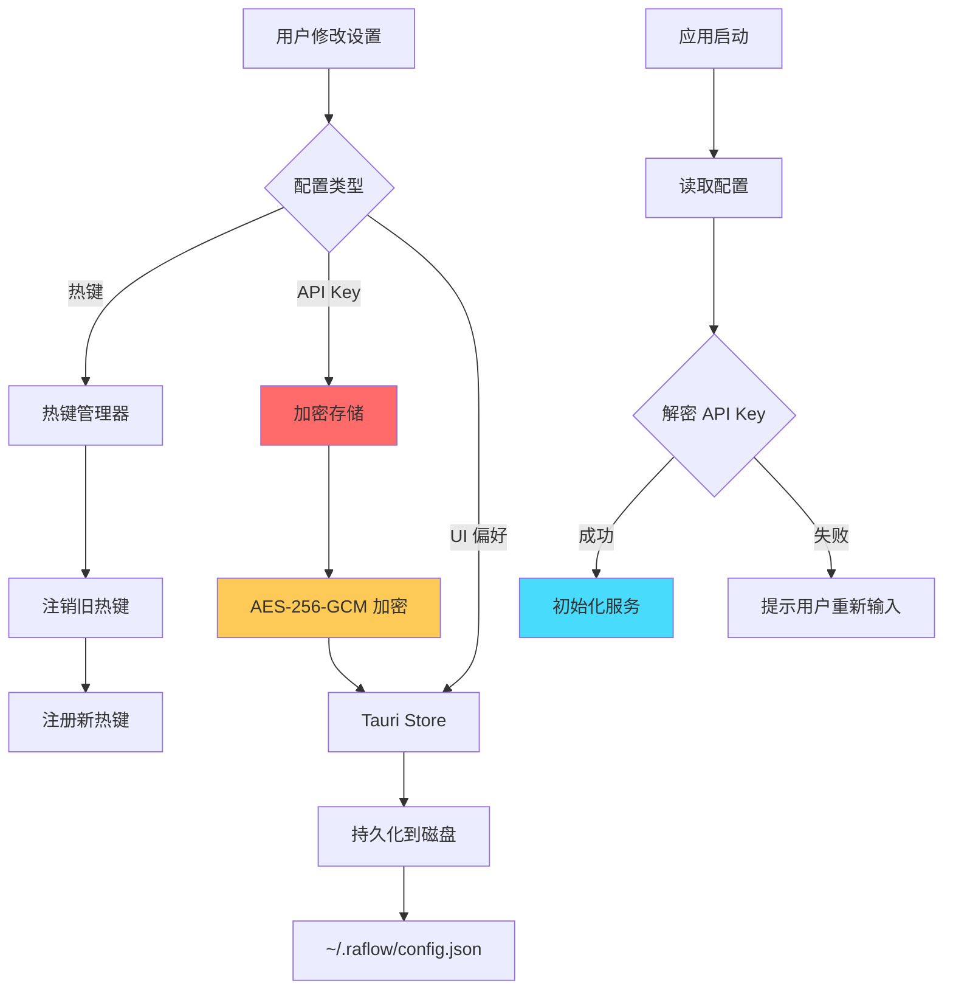
```mermaid
graph TD
    A[用户修改设置] --> B{配置类型}
    B -->|热键| C[热键管理器]
    B -->|API Key| D[加密存储]
    B -->|UI 偏好| E[Tauri Store]

    C --> F[注销旧热键]
    F --> G[注册新热键]

    D --> H[AES-256-GCM 加密]
    H --> E

    E --> I[持久化到磁盘]
    I --> J[~/.raflow/config.json]

    K[应用启动] --> L[读取配置]
    L --> M{解密 API Key}
    M -->|成功| N[初始化服务]
    M -->|失败| O[提示用户重新输入]

    style D fill:#ff6b6b
    style H fill:#feca57
    style N fill:#48dbfb
```

---

## 6. 状态管理设计

### 6.1 状态机设计

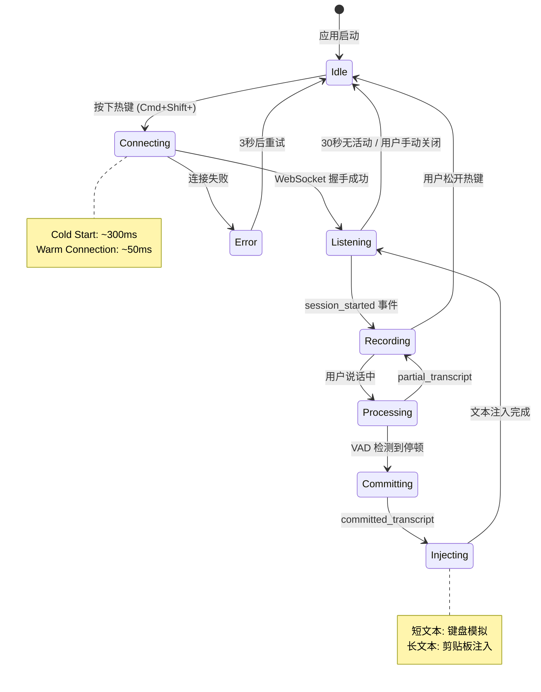
```mermaid
stateDiagram-v2
    [*] --> Idle: 应用启动

    Idle --> Connecting: 按下热键 (Cmd+Shift+\)
    Connecting --> Listening: WebSocket 握手成功
    Connecting --> Error: 连接失败

    Listening --> Recording: session_started 事件
    Recording --> Processing: 用户说话中
    Processing --> Recording: partial_transcript
    Processing --> Committing: VAD 检测到停顿

    Committing --> Injecting: committed_transcript
    Injecting --> Listening: 文本注入完成

    Listening --> Idle: 30秒无活动 / 用户手动关闭
    Recording --> Idle: 用户松开热键
    Error --> Idle: 3秒后重试

    note right of Connecting
        Cold Start: ~300ms
        Warm Connection: ~50ms
    end note

    note right of Injecting
        短文本: 键盘模拟
        长文本: 剪贴板注入
    end note
```

### 6.2 Rust 状态结构

```rust
use std::sync::Arc;
use tokio::sync::{Mutex, RwLock};

/// 应用全局状态
#[derive(Clone)]
pub struct AppState {
    /// 连接状态
    pub connection: Arc<DashMap<String, ConnectionState>>,

    /// 音频流状态
    pub audio: Arc<DashMap<String, AudioState>>,

    /// 当前活跃窗口
    pub active_window: Arc<RwLock<Option<WindowInfo>>>,

    /// 配置
    pub config: Arc<ArcSwap<Config>>,
}

#[derive(Debug, Clone, PartialEq)]
pub enum ConnectionState {
    Idle,
    Connecting { attempt: u32 },
    Listening { session_id: String },
    Recording { start_time: Instant },
    Error { message: String, retry_at: Instant },
}

#[derive(Debug)]
pub struct AudioState {
    pub stream: Option<cpal::Stream>,
    pub resampler: Option<Resampler>,
    pub buffer: RingBuffer,
    pub rms_level: f32, // 当前音量 RMS
}

#[derive(Debug, Clone)]
pub struct WindowInfo {
    pub app_name: String,
    pub title: String,
    pub process_id: u32,
    pub position: (i32, i32, u32, u32), // x, y, width, height
}
```

### 6.3 前端状态管理（Zustand）

```typescript
import { create } from 'zustand';

interface TranscriptState {
  // 当前显示的文本
  partial: string;
  committed: string[];

  // UI 状态
  isRecording: boolean;
  audioLevel: number; // 0-100

  // 连接状态
  connectionState: 'idle' | 'connecting' | 'listening' | 'error';
  errorMessage?: string;

  // Actions
  setPartial: (text: string) => void;
  addCommitted: (text: string) => void;
  setConnectionState: (state: ConnectionState) => void;
  setAudioLevel: (level: number) => void;
  clear: () => void;
}

const useTranscriptStore = create<TranscriptState>((set) => ({
  partial: '',
  committed: [],
  isRecording: false,
  audioLevel: 0,
  connectionState: 'idle',

  setPartial: (text) => set({ partial: text }),
  addCommitted: (text) => set((state) => ({
    committed: [...state.committed, text],
    partial: ''
  })),
  setConnectionState: (connectionState) => set({ connectionState }),
  setAudioLevel: (audioLevel) => set({ audioLevel }),
  clear: () => set({ partial: '', committed: [], audioLevel: 0 }),
}));
```

---

## 7. 网络通信设计

### 7.1 WebSocket 协议实现

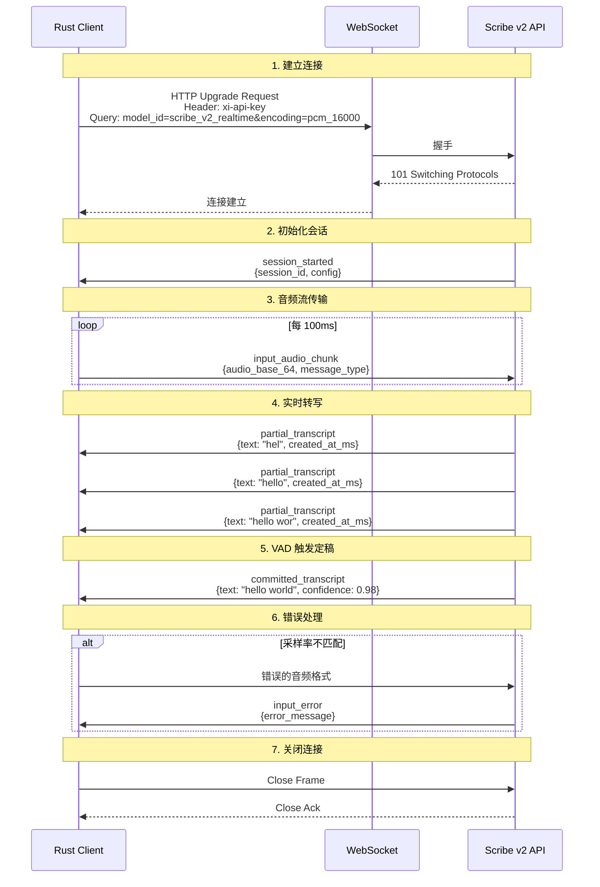
```mermaid
sequenceDiagram
    participant Client as Rust Client
    participant WS as WebSocket
    participant API as Scribe v2 API

    Note over Client,API: 1. 建立连接
    Client->>WS: HTTP Upgrade Request<br/>Header: xi-api-key<br/>Query: model_id=scribe_v2_realtime&encoding=pcm_16000
    WS->>API: 握手
    API-->>WS: 101 Switching Protocols
    WS-->>Client: 连接建立

    Note over Client,API: 2. 初始化会话
    API->>Client: session_started<br/>{session_id, config}

    Note over Client,API: 3. 音频流传输
    loop 每 100ms
        Client->>API: input_audio_chunk<br/>{audio_base_64, message_type}
    end

    Note over Client,API: 4. 实时转写
    API->>Client: partial_transcript<br/>{text: "hel", created_at_ms}
    API->>Client: partial_transcript<br/>{text: "hello", created_at_ms}
    API->>Client: partial_transcript<br/>{text: "hello wor", created_at_ms}

    Note over Client,API: 5. VAD 触发定稿
    API->>Client: committed_transcript<br/>{text: "hello world", confidence: 0.98}

    Note over Client,API: 6. 错误处理
    alt 采样率不匹配
        Client->>API: 错误的音频格式
        API->>Client: input_error<br/>{error_message}
    end

    Note over Client,API: 7. 关闭连接
    Client->>API: Close Frame
    API-->>Client: Close Ack
```

### 7.2 连接管理策略

```rust
use tokio_tungstenite::{connect_async, tungstenite::Message};
use futures_util::{SinkExt, StreamExt};

pub struct ScribeClient {
    config: ClientConfig,
    state: Arc<RwLock<ConnectionState>>,
    tx: mpsc::Sender<ClientCommand>,
}

pub enum ClientCommand {
    Connect,
    SendAudio(Vec<i16>),
    Disconnect,
}

impl ScribeClient {
    /// 智能连接策略
    async fn smart_connect(&self) -> Result<()> {
        let state = self.state.read().await;

        match *state {
            ConnectionState::Idle => {
                // Cold Start: 完整握手流程
                self.connect_cold_start().await?;
            }
            ConnectionState::Connecting { attempt } if attempt < 3 => {
                // 重试连接
                self.retry_connect(attempt).await?;
            }
            ConnectionState::Listening { .. } => {
                // 已连接，跳过
                return Ok(());
            }
            _ => {
                // 错误状态，重置后重连
                drop(state);
                self.reset_and_connect().await?;
            }
        }

        Ok(())
    }

    /// 预热连接（Speculative Connection）
    /// 当用户按下 Cmd+Shift 但还未按 \ 时触发
    pub async fn warm_up(&self) -> Result<()> {
        tokio::spawn(async move {
            // 提前建立 TCP 连接和 TLS 握手
            // 但暂不发送音频数据
        });
        Ok(())
    }

    /// 空闲超时检测
    async fn idle_timeout_checker(&self) {
        let mut interval = tokio::time::interval(Duration::from_secs(5));
        let mut last_activity = Instant::now();

        loop {
            interval.tick().await;

            if last_activity.elapsed() > Duration::from_secs(30) {
                tracing::info!("Idle timeout, disconnecting...");
                self.disconnect().await;
                break;
            }
        }
    }
}
```

### 7.3 错误重试机制

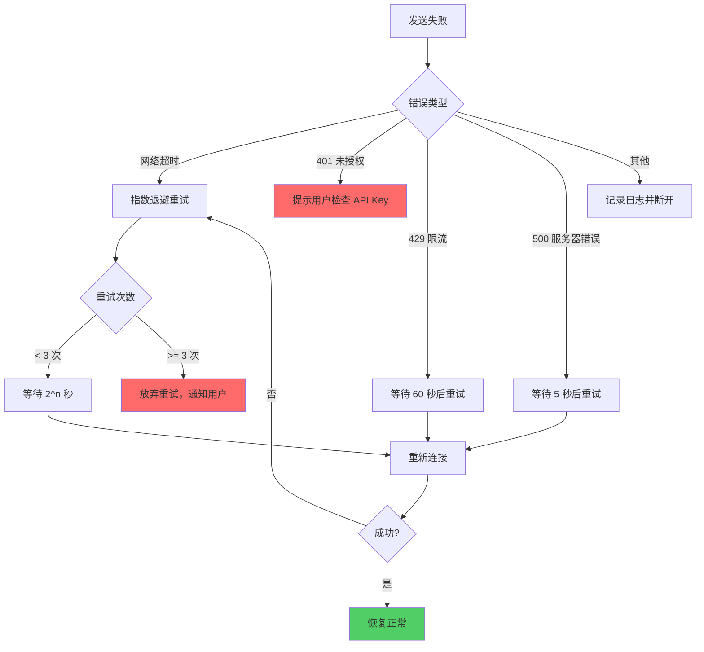
```mermaid
graph TD
    A[发送失败] --> B{错误类型}

    B -->|网络超时| C[指数退避重试]
    B -->|401 未授权| D[提示用户检查 API Key]
    B -->|429 限流| E[等待 60 秒后重试]
    B -->|500 服务器错误| F[等待 5 秒后重试]
    B -->|其他| G[记录日志并断开]

    C --> H{重试次数}
    H -->|< 3 次| I[等待 2^n 秒]
    H -->|>= 3 次| J[放弃重试，通知用户]

    I --> K[重新连接]
    K --> L{成功?}
    L -->|是| M[恢复正常]
    L -->|否| C

    E --> K
    F --> K

    style D fill:#ff6b6b
    style J fill:#ff6b6b
    style M fill:#51cf66
```

---

## 8. 音频处理管道设计

### 8.1 音频采集架构

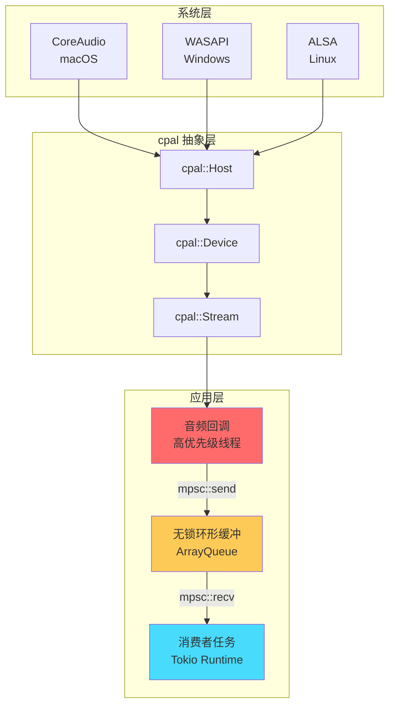
```mermaid
graph TB
    subgraph "系统层"
        CoreAudio[CoreAudio<br/>macOS]
        WASAPI[WASAPI<br/>Windows]
        ALSA[ALSA<br/>Linux]
    end

    subgraph "cpal 抽象层"
        Host[cpal::Host]
        Device[cpal::Device]
        Stream[cpal::Stream]
    end

    subgraph "应用层"
        Callback[音频回调<br/>高优先级线程]
        RingBuf[无锁环形缓冲<br/>ArrayQueue]
        Consumer[消费者任务<br/>Tokio Runtime]
    end

    CoreAudio --> Host
    WASAPI --> Host
    ALSA --> Host

    Host --> Device
    Device --> Stream
    Stream --> Callback

    Callback -->|mpsc::send| RingBuf
    RingBuf -->|mpsc::recv| Consumer

    style Callback fill:#ff6b6b
    style RingBuf fill:#feca57
    style Consumer fill:#48dbfb
```

### 8.2 重采样器设计

```rust
use rubato::{Resampler, SincFixedIn, InterpolationType, InterpolationParameters, WindowFunction};

pub struct AudioResampler {
    resampler: SincFixedIn<f32>,
    input_buffer: Vec<Vec<f32>>,  // [channels][samples]
    output_buffer: Vec<Vec<f32>>,
}

impl AudioResampler {
    pub fn new(input_rate: u32, output_rate: u32, channels: usize) -> Result<Self> {
        // 使用 Sinc 插值，高质量设置
        let params = InterpolationParameters {
            sinc_len: 256,           // 窗口长度
            f_cutoff: 0.95,           // 截止频率
            interpolation: InterpolationType::Linear,
            oversampling_factor: 256,
            window: WindowFunction::BlackmanHarris2,
        };

        let resampler = SincFixedIn::<f32>::new(
            output_rate as f64 / input_rate as f64,
            2.0, // Max relative frequency ratio change
            params,
            480, // Chunk size (10ms @ 48kHz)
            channels,
        )?;

        Ok(Self {
            resampler,
            input_buffer: vec![vec![0.0; 480]; channels],
            output_buffer: vec![vec![0.0; 160]; channels], // 10ms @ 16kHz
        })
    }

    /// 处理音频块：48kHz f32 → 16kHz i16
    pub fn process(&mut self, input: &[f32]) -> Result<Vec<i16>> {
        // 1. 分离通道（如果是立体声，取平均转单声道）
        let mono = if self.input_buffer.len() == 2 {
            input.chunks_exact(2)
                .map(|chunk| (chunk[0] + chunk[1]) / 2.0)
                .collect::<Vec<_>>()
        } else {
            input.to_vec()
        };

        // 2. 填充输入缓冲
        self.input_buffer[0].copy_from_slice(&mono);

        // 3. 重采样
        let (_, output_frames) = self.resampler.process_into_buffer(
            &self.input_buffer,
            &mut self.output_buffer,
            None,
        )?;

        // 4. f32 → i16 转换（量化）
        let i16_samples: Vec<i16> = self.output_buffer[0][..output_frames]
            .iter()
            .map(|&sample| {
                let clamped = sample.clamp(-1.0, 1.0);
                (clamped * 32767.0) as i16
            })
            .collect();

        Ok(i16_samples)
    }

    /// 计算 RMS 音量（用于 UI 波形显示）
    pub fn calculate_rms(samples: &[f32]) -> f32 {
        let sum_squares: f32 = samples.iter().map(|&s| s * s).sum();
        (sum_squares / samples.len() as f32).sqrt()
    }
}
```

### 8.3 音频处理时序图

```mermaid
gantt
    title 音频处理管道时序 (每 10ms 一个周期)
    dateFormat X
    axisFormat %L ms

    section 音频采集
    cpal 回调触发           :0, 0.5
    数据拷贝到 RingBuffer   :0.5, 0.8

    section 异步处理
    从 RingBuffer 读取      :1, 1.2
    重采样 (48k→16k)        :1.2, 3.5
    f32→i16 转换            :3.5, 4.0
    Base64 编码             :4.0, 5.5
    JSON 序列化             :5.5, 6.0

    section 网络传输
    WebSocket 发送          :6.0, 8.0

    section 缓冲区
    累积下一批数据          :8.0, 10.0
```

**关键性能指标：**

- **回调延迟**：< 1ms（保证不丢帧）
- **重采样延迟**：< 2.5ms（Sinc 插值）
- **编码延迟**：< 2ms（Base64 + JSON）
- **总端到端延迟**：< 10ms（本地处理）+ ~150ms（网络 + ASR）

---

## 9. 文本注入策略设计

### 9.1 注入策略决策树

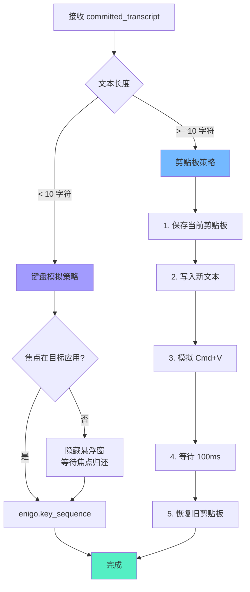
```mermaid
graph TD
    Start[接收 committed_transcript] --> CheckLength{文本长度}

    CheckLength -->|< 10 字符| UseKeyboard[键盘模拟策略]
    CheckLength -->|>= 10 字符| UseClipboard[剪贴板策略]

    UseKeyboard --> CheckFocus{焦点在目标应用?}
    CheckFocus -->|是| SimulateKeys[enigo.key_sequence]
    CheckFocus -->|否| RestoreFocus[隐藏悬浮窗<br/>等待焦点归还]
    RestoreFocus --> SimulateKeys

    UseClipboard --> SaveClipboard[1. 保存当前剪贴板]
    SaveClipboard --> WriteClipboard[2. 写入新文本]
    WriteClipboard --> PasteKey[3. 模拟 Cmd+V]
    PasteKey --> Wait[4. 等待 100ms]
    Wait --> RestoreClipboard[5. 恢复旧剪贴板]

    SimulateKeys --> Done[完成]
    RestoreClipboard --> Done

    style UseKeyboard fill:#a29bfe
    style UseClipboard fill:#74b9ff
    style Done fill:#55efc4
```

### 9.2 焦点管理流程

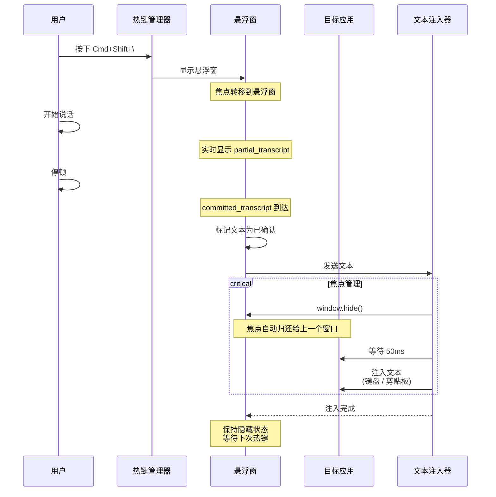
```mermaid
sequenceDiagram
    participant User as 用户
    participant Hotkey as 热键管理器
    participant Overlay as 悬浮窗
    participant TargetApp as 目标应用
    participant Injector as 文本注入器

    User->>Hotkey: 按下 Cmd+Shift+\
    Hotkey->>Overlay: 显示悬浮窗
    Note over Overlay: 焦点转移到悬浮窗

    User->>User: 开始说话
    Note over Overlay: 实时显示 partial_transcript

    User->>User: 停顿
    Note over Overlay: committed_transcript 到达

    Overlay->>Overlay: 标记文本为已确认
    Overlay->>Injector: 发送文本

    critical 焦点管理
        Injector->>Overlay: window.hide()
        Note over Overlay,TargetApp: 焦点自动归还给上一个窗口
        Injector->>TargetApp: 等待 50ms
        Injector->>TargetApp: 注入文本<br/>(键盘 / 剪贴板)
    end

    Injector-->>Overlay: 注入完成
    Note over Overlay: 保持隐藏状态<br/>等待下次热键
```

### 9.3 平台差异处理

```rust
use enigo::{Enigo, Key, KeyboardControllable};

pub struct TextInjector {
    enigo: Enigo,
    clipboard: ClipboardContext,
    config: InjectionConfig,
}

impl TextInjector {
    pub async fn inject(&mut self, text: &str, window: &WindowInfo) -> Result<()> {
        // 1. 检查黑名单（如密码框）
        if self.is_blacklisted(window) {
            tracing::warn!("Target window is blacklisted: {}", window.app_name);
            return Ok(());
        }

        // 2. 选择注入策略
        if text.len() < 10 {
            self.inject_via_keyboard(text).await?;
        } else {
            self.inject_via_clipboard(text).await?;
        }

        Ok(())
    }

    /// 键盘模拟注入（短文本）
    async fn inject_via_keyboard(&mut self, text: &str) -> Result<()> {
        for ch in text.chars() {
            self.enigo.key_sequence(&ch.to_string());
            tokio::time::sleep(Duration::from_millis(5)).await; // 防止输入过快
        }
        Ok(())
    }

    /// 剪贴板注入（长文本）
    async fn inject_via_clipboard(&mut self, text: &str) -> Result<()> {
        // 1. 保存当前剪贴板
        let old_clipboard = self.clipboard.get_contents().ok();

        // 2. 写入新文本
        self.clipboard.set_contents(text.to_string())?;

        // 3. 模拟粘贴快捷键
        #[cfg(target_os = "macos")]
        {
            self.enigo.key_down(Key::Meta); // Cmd
            self.enigo.key_click(Key::Layout('v'));
            self.enigo.key_up(Key::Meta);
        }

        #[cfg(target_os = "windows")]
        {
            self.enigo.key_down(Key::Control);
            self.enigo.key_click(Key::Layout('v'));
            self.enigo.key_up(Key::Control);
        }

        // 4. 等待粘贴完成
        tokio::time::sleep(Duration::from_millis(100)).await;

        // 5. 恢复旧剪贴板
        if let Some(old) = old_clipboard {
            self.clipboard.set_contents(old)?;
        }

        Ok(())
    }

    /// 检查是否为黑名单应用
    fn is_blacklisted(&self, window: &WindowInfo) -> bool {
        const BLACKLIST: &[&str] = &[
            "1Password",
            "Keychain Access",
            "Terminal", // 可选配置
        ];

        BLACKLIST.iter().any(|&app| window.app_name.contains(app))
    }
}
```

---

## 10. UI/UX 设计

### 10.1 悬浮窗设计

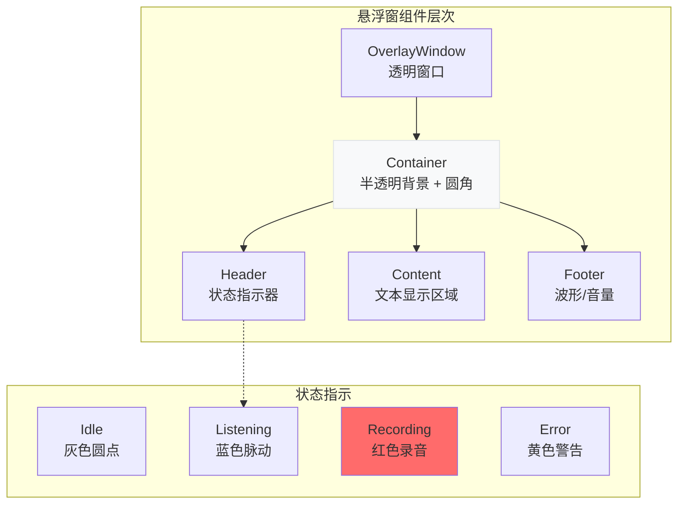
```mermaid
graph TB
    subgraph "悬浮窗组件层次"
        Root[OverlayWindow<br/>透明窗口]
        Container[Container<br/>半透明背景 + 圆角]
        Header[Header<br/>状态指示器]
        Content[Content<br/>文本显示区域]
        Footer[Footer<br/>波形/音量]

        Root --> Container
        Container --> Header
        Container --> Content
        Container --> Footer
    end

    subgraph "状态指示"
        Idle[Idle<br/>灰色圆点]
        Listening[Listening<br/>蓝色脉动]
        Recording[Recording<br/>红色录音]
        Error[Error<br/>黄色警告]
    end

    Header -.-> Listening

    style Container fill:#f8f9fa,stroke:#dee2e6
    style Recording fill:#ff6b6b
```

### 10.2 Tauri 窗口配置

```json
{
  "tauri": {
    "windows": [
      {
        "label": "main",
        "title": "RAFlow Settings",
        "width": 600,
        "height": 400,
        "visible": false,
        "center": true,
        "resizable": false
      },
      {
        "label": "overlay",
        "title": "RAFlow Overlay",
        "width": 400,
        "height": 120,
        "decorations": false,
        "transparent": true,
        "alwaysOnTop": true,
        "skipTaskbar": true,
        "visible": false,
        "center": true,
        "focus": false,
        "macOSPrivateApi": true,
        "acceptFirstMouse": false,
        "tabbingIdentifier": "overlay"
      }
    ]
  }
}
```

### 10.3 React 悬浮窗组件

```tsx
import { useEffect } from 'react';
import { listen } from '@tauri-apps/api/event';
import { useTranscriptStore } from './store';

interface TranscriptEvent {
  text: string;
  is_final: boolean;
  confidence?: number;
}

export function OverlayWindow() {
  const { partial, committed, audioLevel, setPartial, addCommitted, setAudioLevel } =
    useTranscriptStore();

  useEffect(() => {
    // 监听转写事件
    const unlistenTranscript = listen<TranscriptEvent>('transcript_update', (event) => {
      if (event.payload.is_final) {
        addCommitted(event.payload.text);
      } else {
        setPartial(event.payload.text);
      }
    });

    // 监听音量事件
    const unlistenAudio = listen<number>('audio_level', (event) => {
      setAudioLevel(event.payload);
    });

    return () => {
      unlistenTranscript.then(fn => fn());
      unlistenAudio.then(fn => fn());
    };
  }, []);

  return (
    <div className="overlay-container">
      {/* 状态指示器 */}
      <div className="status-indicator">
        <div className={`dot ${audioLevel > 0 ? 'recording' : 'idle'}`} />
      </div>

      {/* 文本显示 */}
      <div className="transcript-area">
        {/* 已确认的文本 */}
        {committed.map((text, i) => (
          <span key={i} className="committed">{text} </span>
        ))}

        {/* 实时文本 */}
        {partial && <span className="partial">{partial}</span>}
      </div>

      {/* 音量波形 */}
      <div className="waveform">
        <div
          className="level-bar"
          style={{ width: `${audioLevel}%` }}
        />
      </div>
    </div>
  );
}
```

### 10.4 CSS 样式设计

```css
.overlay-container {
  width: 400px;
  height: 120px;
  background: rgba(255, 255, 255, 0.95);
  backdrop-filter: blur(20px);
  border-radius: 16px;
  padding: 16px;
  box-shadow: 0 8px 32px rgba(0, 0, 0, 0.1);
  display: flex;
  flex-direction: column;
  gap: 12px;
}

.status-indicator {
  display: flex;
  align-items: center;
  gap: 8px;
}

.dot {
  width: 8px;
  height: 8px;
  border-radius: 50%;
  transition: all 0.3s ease;
}

.dot.idle {
  background: #adb5bd;
}

.dot.recording {
  background: #ff6b6b;
  animation: pulse 1.5s ease-in-out infinite;
}

@keyframes pulse {
  0%, 100% { opacity: 1; transform: scale(1); }
  50% { opacity: 0.5; transform: scale(1.2); }
}

.transcript-area {
  flex: 1;
  overflow-y: auto;
  font-size: 16px;
  line-height: 1.5;
  color: #212529;
}

.committed {
  color: #212529;
  font-weight: 500;
}

.partial {
  color: #868e96;
  font-style: italic;
}

.waveform {
  height: 4px;
  background: #e9ecef;
  border-radius: 2px;
  overflow: hidden;
}

.level-bar {
  height: 100%;
  background: linear-gradient(90deg, #51cf66, #ff6b6b);
  transition: width 0.1s linear;
}
```

---

## 11. 性能优化策略

### 11.1 内存优化

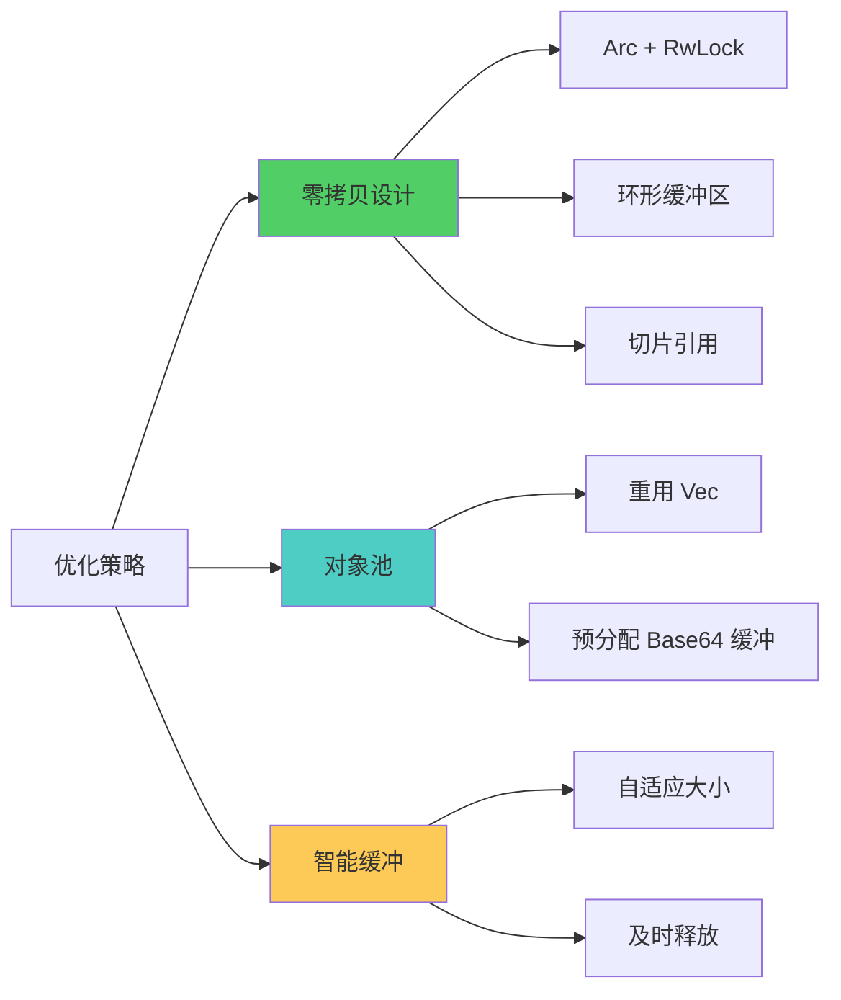
```mermaid
graph LR
    A[优化策略] --> B[零拷贝设计]
    A --> C[对象池]
    A --> D[智能缓冲]

    B --> B1[Arc + RwLock]
    B --> B2[环形缓冲区]
    B --> B3[切片引用]

    C --> C1[重用 Vec<i16>]
    C --> C2[预分配 Base64 缓冲]

    D --> D1[自适应大小]
    D --> D2[及时释放]

    style B fill:#51cf66
    style C fill:#4ecdc4
    style D fill:#feca57
```

### 11.2 CPU 优化

```rust
// 使用 SIMD 加速音频处理
#[cfg(target_arch = "x86_64")]
use std::arch::x86_64::*;

pub fn fast_rms_calculation(samples: &[f32]) -> f32 {
    #[cfg(target_arch = "x86_64")]
    {
        if is_x86_feature_detected!("avx2") {
            unsafe { rms_avx2(samples) }
        } else {
            rms_scalar(samples)
        }
    }

    #[cfg(not(target_arch = "x86_64"))]
    {
        rms_scalar(samples)
    }
}

#[cfg(target_arch = "x86_64")]
#[target_feature(enable = "avx2")]
unsafe fn rms_avx2(samples: &[f32]) -> f32 {
    let mut sum = _mm256_setzero_ps();

    for chunk in samples.chunks_exact(8) {
        let v = _mm256_loadu_ps(chunk.as_ptr());
        let squared = _mm256_mul_ps(v, v);
        sum = _mm256_add_ps(sum, squared);
    }

    // 水平求和并开平方
    let sum_array: [f32; 8] = std::mem::transmute(sum);
    let total: f32 = sum_array.iter().sum();
    (total / samples.len() as f32).sqrt()
}
```

### 11.3 网络优化

| 优化项   | 策略                        | 预期提升              |
|-------|---------------------------|-------------------|
| 连接复用 | 保持 WebSocket 长连接 30 秒 | 减少 300ms 冷启动延迟 |
| 批量发送 | 累积 100ms 音频再发送       | 减少 90% 网络包数量   |
| 压缩传输 | 使用 i16 而非 f32           | 减少 50% 带宽         |
| 并发控制 | Tokio Semaphore 限制并发    | 避免内存爆炸          |

### 11.4 性能监控

```rust
use std::time::Instant;
use tracing::{info, warn};

pub struct PerformanceMonitor {
    audio_callback_times: Vec<Duration>,
    encoding_times: Vec<Duration>,
    network_times: Vec<Duration>,
}

impl PerformanceMonitor {
    pub fn report(&self) {
        let avg_audio = self.average(&self.audio_callback_times);
        let avg_encoding = self.average(&self.encoding_times);
        let avg_network = self.average(&self.network_times);

        info!(
            "Performance Report:\n\
             Audio Callback: {:.2}ms (target: <1ms)\n\
             Encoding: {:.2}ms (target: <2ms)\n\
             Network: {:.2}ms (target: <8ms)",
            avg_audio.as_secs_f64() * 1000.0,
            avg_encoding.as_secs_f64() * 1000.0,
            avg_network.as_secs_f64() * 1000.0,
        );

        if avg_audio.as_millis() > 1 {
            warn!("Audio callback is too slow! Risk of audio dropout.");
        }
    }

    fn average(&self, durations: &[Duration]) -> Duration {
        let sum: Duration = durations.iter().sum();
        sum / durations.len() as u32
    }
}
```

---

## 12. 安全性设计

### 12.1 威胁模型

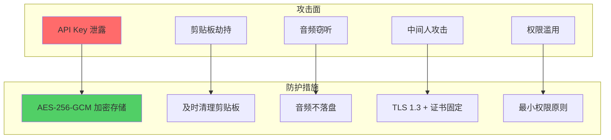
```mermaid
graph TD
    subgraph "攻击面"
        A1[API Key 泄露]
        A2[剪贴板劫持]
        A3[音频窃听]
        A4[中间人攻击]
        A5[权限滥用]
    end

    subgraph "防护措施"
        D1[AES-256-GCM 加密存储]
        D2[及时清理剪贴板]
        D3[音频不落盘]
        D4[TLS 1.3 + 证书固定]
        D5[最小权限原则]
    end

    A1 --> D1
    A2 --> D2
    A3 --> D3
    A4 --> D4
    A5 --> D5

    style A1 fill:#ff6b6b
    style D1 fill:#51cf66
```

### 12.2 API Key 安全存储

```rust
use aes_gcm::{
    aead::{Aead, KeyInit},
    Aes256Gcm, Nonce,
};
use rand::Rng;

pub struct SecureStorage {
    cipher: Aes256Gcm,
}

impl SecureStorage {
    pub fn new() -> Result<Self> {
        // 使用系统 Keychain/Credential Manager 派生密钥
        let key = Self::derive_key_from_system()?;
        let cipher = Aes256Gcm::new(&key);
        Ok(Self { cipher })
    }

    pub fn encrypt_api_key(&self, api_key: &str) -> Result<String> {
        let nonce = Nonce::from_slice(&rand::thread_rng().gen::<[u8; 12]>());
        let ciphertext = self.cipher
            .encrypt(nonce, api_key.as_bytes())
            .map_err(|e| anyhow!("Encryption failed: {}", e))?;

        // 返回 nonce + ciphertext 的 base64
        let mut result = nonce.to_vec();
        result.extend_from_slice(&ciphertext);
        Ok(base64::encode(result))
    }

    pub fn decrypt_api_key(&self, encrypted: &str) -> Result<String> {
        let data = base64::decode(encrypted)?;
        let (nonce_bytes, ciphertext) = data.split_at(12);
        let nonce = Nonce::from_slice(nonce_bytes);

        let plaintext = self.cipher
            .decrypt(nonce, ciphertext)
            .map_err(|e| anyhow!("Decryption failed: {}", e))?;

        Ok(String::from_utf8(plaintext)?)
    }

    #[cfg(target_os = "macos")]
    fn derive_key_from_system() -> Result<Key<Aes256Gcm>> {
        // 使用 macOS Keychain 存储主密钥
        // 或使用 PBKDF2 从设备唯一标识符派生
        todo!()
    }
}
```

### 12.3 权限检查

```rust
#[cfg(target_os = "macos")]
pub mod permissions {
    use objc::runtime::Object;
    use objc::{class, msg_send, sel, sel_impl};

    /// 检查并请求 Accessibility 权限
    pub fn check_accessibility_permission() -> bool {
        use accessibility_sys::*;

        unsafe {
            let trusted = AXIsProcessTrusted();
            if !trusted {
                // 显示系统权限提示
                let options = CFDictionaryCreate(
                    kCFAllocatorDefault,
                    &kAXTrustedCheckOptionPrompt as *const _ as *const _,
                    &kCFBooleanTrue as *const _ as *const _,
                    1,
                    &kCFTypeDictionaryKeyCallBacks,
                    &kCFTypeDictionaryValueCallBacks,
                );
                AXIsProcessTrustedWithOptions(options);
            }
            trusted
        }
    }

    /// 检查屏幕录制权限（获取窗口标题需要）
    pub fn check_screen_recording_permission() -> bool {
        // 尝试获取窗口列表，如果失败说明没有权限
        match active_win_pos_rs::get_active_window() {
            Ok(window) => !window.title.is_empty(),
            Err(_) => false,
        }
    }
}
```

### 12.4 数据隐私保护

```rust
pub struct PrivacyGuard;

impl PrivacyGuard {
    /// 确保音频数据不写入磁盘
    pub fn configure_no_disk_cache() {
        std::env::set_var("TMPDIR", "/dev/null"); // 禁用临时文件
    }

    /// 在应用退出时清理内存
    pub fn secure_cleanup() {
        // 使用 zeroize crate 覆盖敏感内存
        // 防止内存转储泄露
    }

    /// 检测调试器
    pub fn anti_debug_check() -> bool {
        #[cfg(target_os = "macos")]
        {
            use sysctl::Sysctl;
            let ctl = sysctl::Ctl::new("sysctl.proc_info").ok()?;
            // 检查 P_TRACED 标志
            // 返回 true 表示被调试
        }
        false
    }
}
```

---

## 13. 部署与打包

### 13.1 构建流程

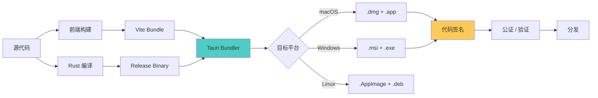
```mermaid
graph LR
    A[源代码] --> B[前端构建]
    B --> C[Vite Bundle]

    A --> D[Rust 编译]
    D --> E[Release Binary]

    C --> F[Tauri Bundler]
    E --> F

    F --> G{目标平台}

    G -->|macOS| H[.dmg + .app]
    G -->|Windows| I[.msi + .exe]
    G -->|Linux| J[.AppImage + .deb]

    H --> K[代码签名]
    I --> K

    K --> L[公证 / 验证]
    L --> M[分发]

    style F fill:#4ecdc4
    style K fill:#feca57
```

### 13.2 macOS 代码签名配置

```json
{
  "tauri": {
    "bundle": {
      "identifier": "com.raflow.app",
      "icon": [
        "icons/32x32.png",
        "icons/128x128.png",
        "icons/icon.icns"
      ],
      "macOS": {
        "entitlements": "entitlements.plist",
        "exceptionDomain": "",
        "frameworks": [],
        "providerShortName": "YourTeamID",
        "signingIdentity": "Developer ID Application: Your Name (TEAMID)",
        "hardenedRuntime": true,
        "minimumSystemVersion": "10.15"
      }
    }
  }
}
```

**entitlements.plist:**

```xml
<?xml version="1.0" encoding="UTF-8"?>
<!DOCTYPE plist PUBLIC "-//Apple//DTD PLIST 1.0//EN" "http://www.apple.com/DTDs/PropertyList-1.0.dtd">
<plist version="1.0">
<dict>
    <key>com.apple.security.automation.apple-events</key>
    <true/>
    <key>com.apple.security.device.audio-input</key>
    <true/>
    <key>com.apple.security.personal-information.addressbook</key>
    <false/>
</dict>
</plist>
```

### 13.3 自动更新配置

```json
{
  "tauri": {
    "updater": {
      "active": true,
      "endpoints": [
        "https://releases.raflow.app/{{target}}/{{current_version}}"
      ],
      "dialog": true,
      "pubkey": "YOUR_PUBLIC_KEY_HERE"
    }
  }
}
```

---

## 14. 参考资源

### 14.1 官方文档

1. **Tauri v2**: [https://v2.tauri.app/](https://v2.tauri.app/)
   - [Tauri 2.0 Stable Release](https://v2.tauri.app/blog/tauri-20/)
   - [Global Shortcut Plugin](https://v2.tauri.app/plugin/global-shortcut/)
   - [System Tray](https://v2.tauri.app/learn/system-tray/)

2. **ElevenLabs Scribe v2**: [https://elevenlabs.io/docs](https://elevenlabs.io/docs)
   - [Realtime Speech to Text API](https://elevenlabs.io/docs/api-reference/speech-to-text/v-1-speech-to-text-realtime)
   - [WebSocket Streaming Guide](https://elevenlabs.io/docs/cookbooks/speech-to-text/streaming)
   - [Scribe v2 Blog Post](https://elevenlabs.io/blog/introducing-scribe-v2-realtime)

3. **Rust Crates**:
   - [cpal 0.16](https://github.com/RustAudio/cpal) - Cross-platform audio I/O
   - [tokio-tungstenite](https://lib.rs/crates/tokio-tungstenite) - Async WebSocket
   - [rubato](https://github.com/HEnquist/rubato) - Audio resampling
   - [enigo 0.6.1](https://lib.rs/crates/enigo) - Input simulation
   - [active-win-pos-rs](https://github.com/dimusic/active-win-pos-rs) - Window tracking

### 14.2 技术文章

1. [Rust Audio Programming Ecosystem 2025](https://andrewodendaal.com/rust-audio-programming-ecosystem/)
2. [Building System Tray Apps with Tauri](https://tauritutorials.com/blog/building-a-system-tray-app-with-tauri)
3. [macOS App Nap Prevention](https://developer.apple.com/library/archive/documentation/Performance/Conceptual/power_efficiency_guidelines_osx/AppNap.html)

### 14.3 开源项目参考

1. **Wispr Flow** (闭源，但可研究其 UX 模式)
2. **Tauri Examples**: [https://github.com/tauri-apps/tauri/tree/dev/examples](https://github.com/tauri-apps/tauri/tree/dev/examples)

---

## 附录

### A. 术语表

| 术语 | 全称                             | 说明                   |
|------|----------------------------------|----------------------|
| ASR  | Automatic Speech Recognition     | 自动语音识别           |
| STT  | Speech to Text                   | 语音转文本             |
| VAD  | Voice Activity Detection         | 语音活动检测           |
| PCM  | Pulse Code Modulation            | 脉冲编码调制（音频格式） |
| RMS  | Root Mean Square                 | 均方根（音量计算）       |
| IPC  | Inter-Process Communication      | 进程间通信             |
| ACL  | Access Control List              | 访问控制列表           |
| SIMD | Single Instruction Multiple Data | 单指令多数据流         |

### B. 开发环境配置

```bash
# 安装 Rust
curl --proto '=https' --tlsv1.2 -sSf https://sh.rustup.rs | sh
rustup default stable
rustup target add aarch64-apple-darwin  # Apple Silicon
rustup target add x86_64-apple-darwin   # Intel Mac

# 安装 Tauri CLI
cargo install tauri-cli@^2.0.0

# 安装 Node.js 依赖
npm install

# 开发模式运行
cargo tauri dev

# 生产构建
cargo tauri build
```

### C. 故障排查清单

| 问题           | 可能原因               | 解决方案                    |
|--------------|----------------------|-------------------------|
| 音频无输入     | 权限未授予             | 检查"隐私与安全性 > 麦克风" |
| 无法注入文本   | Accessibility 权限缺失 | 手动添加到"辅助功能"列表    |
| WebSocket 断开 | API Key 错误           | 验证 ElevenLabs 密钥有效性  |
| 应用崩溃       | 内存泄漏               | 检查 `Arc<Mutex<T>>` 死锁   |
| 音频爆音       | 回调线程阻塞           | 优化回调函数，避免 I/O       |

---

**文档版本**: v1.0.0
**最后更新**: 2025-11-22
**维护者**: RAFlow 开发团队
