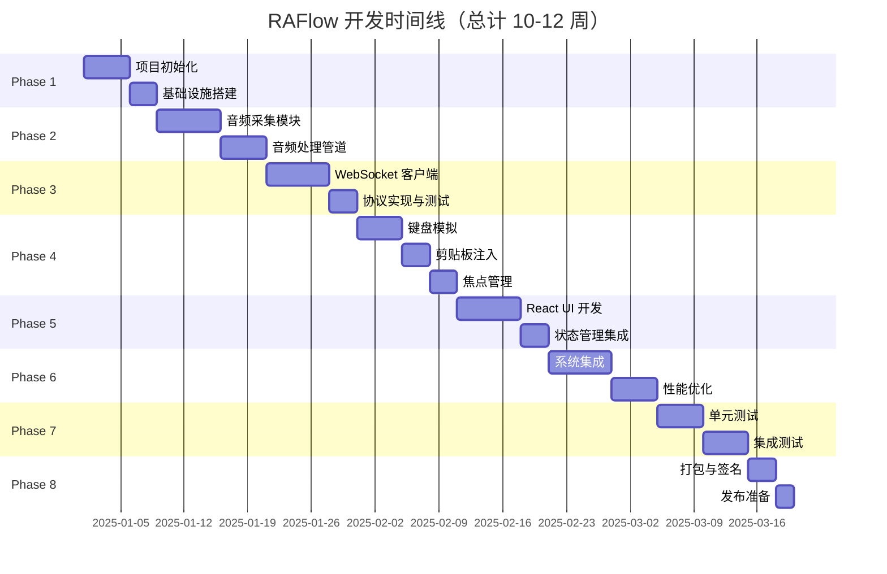
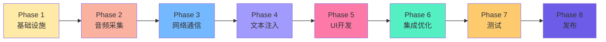
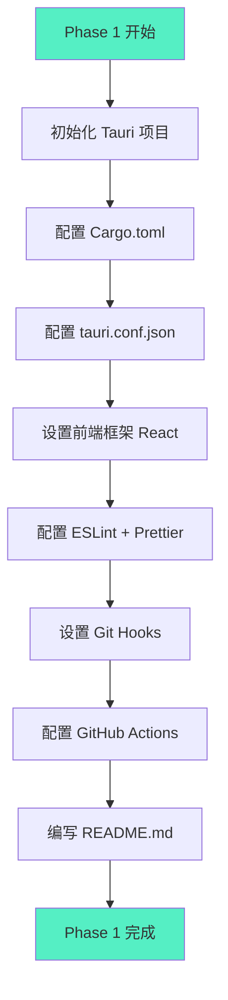
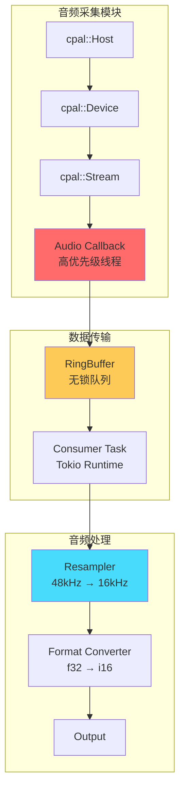
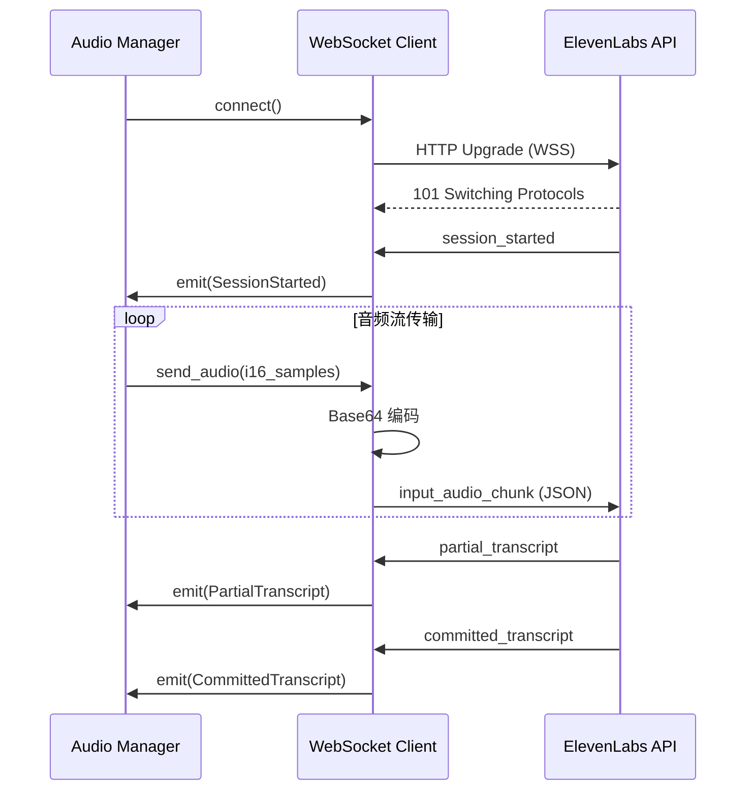
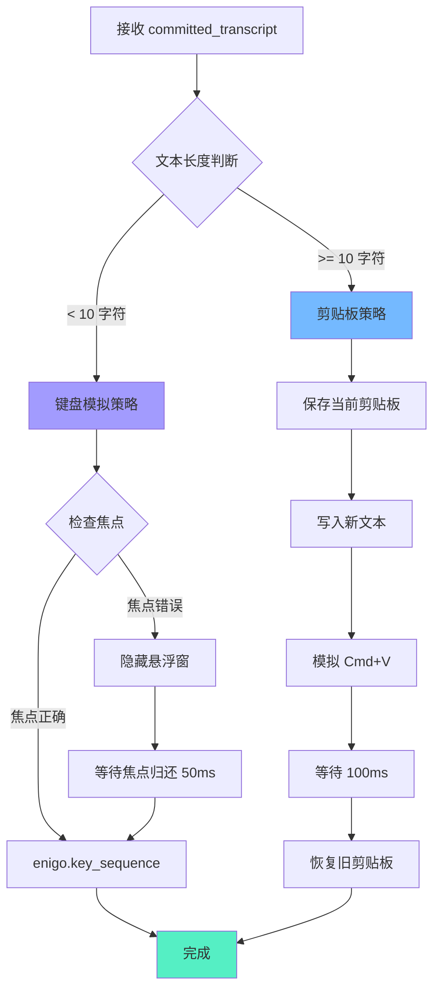
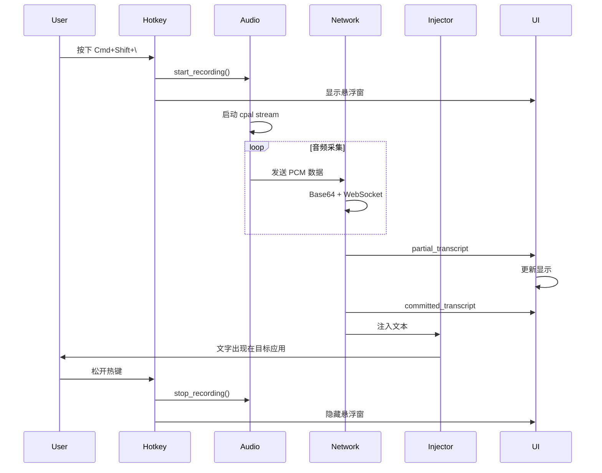
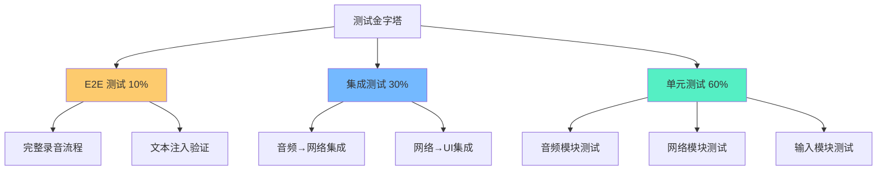

# RAFlow 实施计划

> 基于设计文档的详细开发路线图
>
> 版本: 1.0.0
> 日期: 2025-11-22

---

## 目录

1. [项目概述](#1-项目概述)
2. [开发阶段划分](#2-开发阶段划分)
3. [Phase 1: 项目初始化与基础设施](#phase-1-项目初始化与基础设施)
4. [Phase 2: 音频采集与处理](#phase-2-音频采集与处理)
5. [Phase 3: 网络通信层](#phase-3-网络通信层)
6. [Phase 4: 文本注入系统](#phase-4-文本注入系统)
7. [Phase 5: UI 与交互](#phase-5-ui-与交互)
8. [Phase 6: 系统集成与优化](#phase-6-系统集成与优化)
9. [Phase 7: 测试与质量保证](#phase-7-测试与质量保证)
10. [Phase 8: 部署与发布](#phase-8-部署与发布)
11. [风险管理](#风险管理)
12. [资源规划](#资源规划)
13. [里程碑与交付物](#里程碑与交付物)

---

## 1. 项目概述

### 1.1 项目目标

构建一个生产级的实时语音听写工具 RAFlow，实现以下核心功能：

- ✅ 全局热键触发（Cmd+Shift+\）
- ✅ 实时语音转文本（<150ms 延迟）
- ✅ 智能文本注入（支持多应用）
- ✅ 系统托盘常驻
- ✅ 跨平台支持（macOS 优先，Windows/Linux 后续）

### 1.2 技术约束

- **性能要求**：
  - 内存占用 < 50MB（空闲）
  - CPU 占用 < 5%（录音时）
  - 音频延迟 < 10ms（本地处理）

- **兼容性要求**：
  - macOS 10.15+ (Catalina)
  - Rust 1.90+
  - Node.js 18+ LTS

### 1.3 开发周期估算



---

## 2. 开发阶段划分

### 2.1 迭代策略

采用**增量式开发**，每个 Phase 完成后都有可演示的功能模块：



### 2.2 并行开发策略

某些模块可以并行开发以加速进度：

| 可并行模块 | 依赖关系 | 建议团队规模 |
|-----------|---------|-------------|
| 音频采集 + 前端 UI | 独立开发 | 2 人 |
| 网络通信 + 配置管理 | 独立开发 | 2 人 |
| 文本注入 + 权限检查 | 松耦合 | 2 人 |

---

## Phase 1: 项目初始化与基础设施

**目标**：搭建项目骨架，配置开发环境，建立 CI/CD 流程。

### 1.1 任务清单



### 1.2 详细步骤

#### 1.2.1 创建 Tauri 项目

```bash
# 安装 Tauri CLI
cargo install tauri-cli@^2.0.0

# 创建新项目
cargo tauri init

# 选择配置
# - App name: RAFlow
# - Window title: RAFlow
# - Web assets: ../dist
# - Dev server: http://localhost:5173
# - Frontend framework: React
```

#### 1.2.2 配置 Cargo.toml

```toml
[package]
name = "raflow"
version = "0.1.0"
edition = "2024"
rust-version = "1.90"
authors = ["RAFlow Team"]
license = "MIT"
description = "实时语音听写工具"

[dependencies]
# Tauri 核心
tauri = { version = "2.1", features = ["tray-icon", "protocol-asset"] }
tauri-plugin-global-shortcut = "2.3.0"
tauri-plugin-clipboard-manager = "2.1"
tauri-plugin-dialog = "2.1"
tauri-plugin-fs = "2.1"
tauri-plugin-store = "2.1"

# 异步运行时
tokio = { version = "1.40", features = ["full"] }
tokio-tungstenite = { version = "0.24", features = ["rustls-tls-native-roots"] }
futures-util = "0.3"

# 音频处理
cpal = "0.16"
rubato = "0.16.2"

# 系统交互
enigo = "0.6.1"
active-win-pos-rs = "0.9"

# 序列化
serde = { version = "1.0", features = ["derive"] }
serde_json = "1.0"

# 工具库
anyhow = "1.0"
thiserror = "1.0"
tracing = "0.1"
tracing-subscriber = { version = "0.3", features = ["env-filter"] }
base64 = "0.22"
dashmap = "6.0"
arc-swap = "1.7"

[target.'cfg(target_os = "macos")'.dependencies]
objc = "0.2"
cocoa = "0.25"
core-foundation = "0.9"

[dev-dependencies]
criterion = "0.5"
mockall = "0.12"

[profile.release]
opt-level = 3
lto = true
codegen-units = 1
strip = true
```

#### 1.2.3 配置 tauri.conf.json

```json
{
  "$schema": "https://schema.tauri.app/config/2",
  "productName": "RAFlow",
  "version": "0.1.0",
  "identifier": "com.raflow.app",
  "build": {
    "beforeDevCommand": "npm run dev",
    "beforeBuildCommand": "npm run build",
    "devUrl": "http://localhost:5173",
    "frontendDist": "../dist"
  },
  "app": {
    "windows": [
      {
        "label": "main",
        "title": "RAFlow Settings",
        "width": 600,
        "height": 400,
        "visible": false,
        "center": true,
        "resizable": false
      },
      {
        "label": "overlay",
        "title": "RAFlow Overlay",
        "width": 400,
        "height": 120,
        "decorations": false,
        "transparent": true,
        "alwaysOnTop": true,
        "skipTaskbar": true,
        "visible": false,
        "center": true,
        "focus": false
      }
    ],
    "security": {
      "csp": "default-src 'self'; connect-src 'self' wss://api.elevenlabs.io"
    }
  },
  "bundle": {
    "active": true,
    "targets": "all",
    "icon": [
      "icons/32x32.png",
      "icons/128x128.png",
      "icons/icon.icns"
    ],
    "macOS": {
      "minimumSystemVersion": "10.15",
      "hardenedRuntime": true
    }
  }
}
```

#### 1.2.4 设置前端项目

```bash
# 安装依赖
npm install react@^19.2.0 react-dom@^19.2.0
npm install -D vite@^6 @vitejs/plugin-react
npm install zustand@^5.0.8
npm install tailwindcss@^4.1.17 autoprefixer postcss
npm install @tauri-apps/api@^2.1.0
npm install @tauri-apps/plugin-global-shortcut@^2.3.0
npm install @tauri-apps/plugin-clipboard-manager@^2.1.0
```

**package.json:**

```json
{
  "name": "raflow-ui",
  "version": "0.1.0",
  "type": "module",
  "scripts": {
    "dev": "vite",
    "build": "vite build",
    "lint": "eslint . --ext ts,tsx",
    "format": "prettier --write \"src/**/*.{ts,tsx}\""
  }
}
```

#### 1.2.5 配置 CI/CD (GitHub Actions)

**.github/workflows/ci.yml:**

```yaml
name: CI

on:
  push:
    branches: [main, develop]
  pull_request:
    branches: [main]

jobs:
  test:
    runs-on: macos-latest
    steps:
      - uses: actions/checkout@v4

      - name: Setup Rust
        uses: dtolnay/rust-toolchain@stable
        with:
          toolchain: stable

      - name: Cache cargo registry
        uses: actions/cache@v4
        with:
          path: ~/.cargo/registry
          key: ${{ runner.os }}-cargo-registry-${{ hashFiles('**/Cargo.lock') }}

      - name: Run tests
        run: cargo test --all-features

      - name: Run clippy
        run: cargo clippy -- -D warnings

  build:
    runs-on: macos-latest
    needs: test
    steps:
      - uses: actions/checkout@v4

      - name: Setup Node.js
        uses: actions/setup-node@v4
        with:
          node-version: '18'

      - name: Install dependencies
        run: npm ci

      - name: Build frontend
        run: npm run build

      - name: Build Tauri app
        run: cargo tauri build
```

### 1.3 交付物

- ✅ 可编译的 Tauri 项目骨架
- ✅ 配置完整的开发环境
- ✅ CI/CD 流程（自动化测试 + 构建）
- ✅ 项目文档（README.md + CONTRIBUTING.md）

### 1.4 验收标准

```bash
# 检查列表
✓ cargo tauri dev 可正常启动
✓ 前端热重载工作正常
✓ GitHub Actions 构建通过
✓ 代码格式化工具配置正确
```

---

## Phase 2: 音频采集与处理

**目标**：实现音频采集、重采样、RMS 计算等核心音频处理功能。

### 2.1 架构设计



### 2.2 任务清单

#### 2.2.1 音频采集基础 (3天)

**src-tauri/src/audio/capture.rs:**

```rust
use cpal::traits::{DeviceTrait, HostTrait, StreamTrait};
use cpal::{Device, Host, Stream, StreamConfig};
use anyhow::{Context, Result};
use tracing::{info, warn};

pub struct AudioCapture {
    host: Host,
    device: Device,
    config: StreamConfig,
    stream: Option<Stream>,
}

impl AudioCapture {
    /// 初始化音频采集器
    pub fn new() -> Result<Self> {
        let host = cpal::default_host();
        info!("Audio host: {:?}", host.id());

        let device = host
            .default_input_device()
            .context("No input device available")?;
        info!("Input device: {}", device.name()?);

        let config = device.default_input_config()?.into();
        info!("Device config: {:?}", config);

        Ok(Self {
            host,
            device,
            config,
            stream: None,
        })
    }

    /// 启动音频流
    pub fn start<F>(&mut self, callback: F) -> Result<()>
    where
        F: FnMut(&[f32]) + Send + 'static,
    {
        let stream = self.device.build_input_stream(
            &self.config,
            move |data: &[f32], _: &cpal::InputCallbackInfo| {
                callback(data);
            },
            |err| {
                warn!("Audio stream error: {}", err);
            },
            None,
        )?;

        stream.play()?;
        self.stream = Some(stream);
        info!("Audio stream started");
        Ok(())
    }

    /// 停止音频流
    pub fn stop(&mut self) {
        if let Some(stream) = self.stream.take() {
            drop(stream);
            info!("Audio stream stopped");
        }
    }

    /// 获取采样率
    pub fn sample_rate(&self) -> u32 {
        self.config.sample_rate.0
    }
}

impl Drop for AudioCapture {
    fn drop(&mut self) {
        self.stop();
    }
}
```

**测试代码 (tests/audio_capture_test.rs):**

```rust
#[cfg(test)]
mod tests {
    use super::*;
    use std::sync::Arc;
    use std::sync::atomic::{AtomicUsize, Ordering};

    #[test]
    fn test_audio_capture_initialization() {
        let capture = AudioCapture::new();
        assert!(capture.is_ok());
    }

    #[test]
    fn test_audio_stream_callback() {
        let mut capture = AudioCapture::new().unwrap();
        let counter = Arc::new(AtomicUsize::new(0));
        let counter_clone = counter.clone();

        capture.start(move |_data| {
            counter_clone.fetch_add(1, Ordering::Relaxed);
        }).unwrap();

        // 等待 100ms
        std::thread::sleep(std::time::Duration::from_millis(100));

        // 检查回调是否被调用
        assert!(counter.load(Ordering::Relaxed) > 0);
    }
}
```

#### 2.2.2 环形缓冲区实现 (2天)

**src-tauri/src/audio/buffer.rs:**

```rust
use crossbeam::queue::ArrayQueue;
use std::sync::Arc;

/// 无锁环形缓冲区
pub struct RingBuffer {
    queue: Arc<ArrayQueue<Vec<f32>>>,
    pool: Arc<ArrayQueue<Vec<f32>>>,
    capacity: usize,
}

impl RingBuffer {
    pub fn new(capacity: usize, buffer_size: usize) -> Self {
        let queue = Arc::new(ArrayQueue::new(capacity));
        let pool = Arc::new(ArrayQueue::new(capacity));

        // 预分配缓冲区对象（对象池模式）
        for _ in 0..capacity {
            let _ = pool.push(Vec::with_capacity(buffer_size));
        }

        Self {
            queue,
            pool,
            capacity,
        }
    }

    /// 推送数据（生产者）
    pub fn push(&self, data: &[f32]) -> bool {
        // 从对象池获取 Vec
        if let Some(mut buffer) = self.pool.pop() {
            buffer.clear();
            buffer.extend_from_slice(data);
            self.queue.push(buffer).is_ok()
        } else {
            // 对象池耗尽，分配新 Vec（不推荐）
            self.queue.push(data.to_vec()).is_ok()
        }
    }

    /// 弹出数据（消费者）
    pub fn pop(&self) -> Option<Vec<f32>> {
        self.queue.pop()
    }

    /// 回收 Vec 到对象池
    pub fn recycle(&self, buffer: Vec<f32>) {
        let _ = self.pool.push(buffer);
    }

    /// 获取当前队列长度
    pub fn len(&self) -> usize {
        self.queue.len()
    }
}
```

#### 2.2.3 重采样器实现 (4天)

**src-tauri/src/audio/resampler.rs:**

```rust
use rubato::{
    Resampler, SincFixedIn, InterpolationType, InterpolationParameters, WindowFunction,
};
use anyhow::Result;

pub struct AudioResampler {
    resampler: SincFixedIn<f32>,
    input_buffer: Vec<Vec<f32>>,
    output_buffer: Vec<Vec<f32>>,
    chunk_size: usize,
}

impl AudioResampler {
    pub fn new(
        input_rate: u32,
        output_rate: u32,
        chunk_size: usize,
        channels: usize,
    ) -> Result<Self> {
        let params = InterpolationParameters {
            sinc_len: 256,
            f_cutoff: 0.95,
            interpolation: InterpolationType::Linear,
            oversampling_factor: 256,
            window: WindowFunction::BlackmanHarris2,
        };

        let resampler = SincFixedIn::<f32>::new(
            output_rate as f64 / input_rate as f64,
            2.0,
            params,
            chunk_size,
            channels,
        )?;

        let output_size = (chunk_size as f64 * output_rate as f64 / input_rate as f64).ceil() as usize;

        Ok(Self {
            resampler,
            input_buffer: vec![vec![0.0; chunk_size]; channels],
            output_buffer: vec![vec![0.0; output_size]; channels],
            chunk_size,
        })
    }

    /// 处理音频块：f32 -> f32 (重采样)
    pub fn process(&mut self, input: &[f32]) -> Result<Vec<f32>> {
        // 转为单声道（如果是立体声）
        let mono = if input.len() == self.chunk_size * 2 {
            input
                .chunks_exact(2)
                .map(|ch| (ch[0] + ch[1]) / 2.0)
                .collect::<Vec<_>>()
        } else {
            input.to_vec()
        };

        self.input_buffer[0].copy_from_slice(&mono);

        let (_, frames_out) = self.resampler.process_into_buffer(
            &self.input_buffer,
            &mut self.output_buffer,
            None,
        )?;

        Ok(self.output_buffer[0][..frames_out].to_vec())
    }

    /// f32 -> i16 量化
    pub fn quantize_to_i16(samples: &[f32]) -> Vec<i16> {
        samples
            .iter()
            .map(|&s| {
                let clamped = s.clamp(-1.0, 1.0);
                (clamped * 32767.0) as i16
            })
            .collect()
    }

    /// 计算 RMS 音量
    pub fn calculate_rms(samples: &[f32]) -> f32 {
        let sum_squares: f32 = samples.iter().map(|&s| s * s).sum();
        (sum_squares / samples.len() as f32).sqrt()
    }
}
```

#### 2.2.4 音频管理器集成 (2天)

**src-tauri/src/audio/mod.rs:**

```rust
mod capture;
mod buffer;
mod resampler;

pub use capture::AudioCapture;
pub use buffer::RingBuffer;
pub use resampler::AudioResampler;

use tokio::sync::mpsc;
use tracing::info;

pub struct AudioManager {
    capture: AudioCapture,
    buffer: RingBuffer,
    resampler: AudioResampler,
    output_tx: mpsc::Sender<Vec<i16>>,
}

impl AudioManager {
    pub fn new(output_tx: mpsc::Sender<Vec<i16>>) -> anyhow::Result<Self> {
        let capture = AudioCapture::new()?;
        let sample_rate = capture.sample_rate();

        info!("Device sample rate: {}Hz", sample_rate);

        let buffer = RingBuffer::new(100, 480); // 100 个缓冲块，每块 480 帧
        let resampler = AudioResampler::new(sample_rate, 16000, 480, 1)?;

        Ok(Self {
            capture,
            buffer,
            resampler,
            output_tx,
        })
    }

    pub fn start(&mut self) -> anyhow::Result<()> {
        let buffer = self.buffer.clone();

        self.capture.start(move |data| {
            buffer.push(data);
        })?;

        // 启动消费者任务
        self.spawn_consumer_task();

        Ok(())
    }

    fn spawn_consumer_task(&self) {
        let buffer = self.buffer.clone();
        let mut resampler = self.resampler.clone();
        let output_tx = self.output_tx.clone();

        tokio::spawn(async move {
            loop {
                if let Some(audio_chunk) = buffer.pop() {
                    // 重采样
                    match resampler.process(&audio_chunk) {
                        Ok(resampled) => {
                            // 量化为 i16
                            let i16_samples = AudioResampler::quantize_to_i16(&resampled);

                            // 发送到网络模块
                            if output_tx.send(i16_samples).await.is_err() {
                                break;
                            }
                        }
                        Err(e) => {
                            tracing::error!("Resampling error: {}", e);
                        }
                    }

                    // 回收缓冲区
                    buffer.recycle(audio_chunk);
                } else {
                    tokio::time::sleep(tokio::time::Duration::from_millis(5)).await;
                }
            }
        });
    }
}
```

### 2.3 交付物

- ✅ 音频采集模块（支持 macOS CoreAudio）
- ✅ 环形缓冲区（无锁实现）
- ✅ 重采样器（48kHz → 16kHz）
- ✅ RMS 音量计算
- ✅ 单元测试覆盖率 > 80%

### 2.4 验收标准

```bash
# 测试命令
cargo test --package raflow --lib audio

# 性能基准测试
cargo bench --bench audio_benchmark

# 预期结果
✓ 音频回调延迟 < 1ms
✓ 重采样吞吐量 > 10x 实时（可处理 10 路并发）
✓ 内存占用稳定（无泄漏）
```

---

## Phase 3: 网络通信层

**目标**：实现 ElevenLabs Scribe v2 WebSocket 客户端，支持连接管理、协议编解码。

### 3.1 架构设计



### 3.2 任务清单

#### 3.2.1 WebSocket 客户端基础 (3天)

**src-tauri/src/network/client.rs:**

```rust
use tokio_tungstenite::{connect_async, tungstenite::Message};
use futures_util::{SinkExt, StreamExt};
use anyhow::{Context, Result};
use tracing::{info, warn};

pub struct ScribeClient {
    api_key: String,
    url: String,
}

impl ScribeClient {
    pub fn new(api_key: String) -> Self {
        Self {
            api_key,
            url: "wss://api.elevenlabs.io/v1/speech-to-text/realtime".to_string(),
        }
    }

    /// 建立连接
    pub async fn connect(&self) -> Result<(WsSink, WsStream)> {
        let url = format!(
            "{}?model_id=scribe_v2_realtime&language_code=zh&encoding=pcm_16000",
            self.url
        );

        let mut request = url.into_client_request()?;
        request.headers_mut().insert(
            "xi-api-key",
            self.api_key.parse().unwrap(),
        );

        let (ws_stream, response) = connect_async(request).await
            .context("Failed to connect to ElevenLabs")?;

        info!("WebSocket connected: {:?}", response.status());

        let (sink, stream) = ws_stream.split();
        Ok((sink, stream))
    }
}

type WsSink = futures_util::stream::SplitSink<
    tokio_tungstenite::WebSocketStream<
        tokio_tungstenite::MaybeTlsStream<tokio::net::TcpStream>
    >,
    Message
>;

type WsStream = futures_util::stream::SplitStream<
    tokio_tungstenite::WebSocketStream<
        tokio_tungstenite::MaybeTlsStream<tokio::net::TcpStream>
    >
>;
```

#### 3.2.2 协议消息定义 (2天)

**src-tauri/src/network/protocol.rs:**

```rust
use serde::{Deserialize, Serialize};

#[derive(Debug, Serialize)]
#[serde(tag = "message_type")]
pub enum ClientMessage {
    #[serde(rename = "input_audio_chunk")]
    AudioChunk { audio_base_64: String },
}

#[derive(Debug, Deserialize)]
#[serde(tag = "message_type")]
pub enum ServerMessage {
    #[serde(rename = "session_started")]
    SessionStarted {
        session_id: String,
        #[serde(default)]
        config: serde_json::Value,
    },

    #[serde(rename = "partial_transcript")]
    PartialTranscript {
        text: String,
        created_at_ms: u64,
    },

    #[serde(rename = "committed_transcript")]
    CommittedTranscript {
        text: String,
        confidence: f32,
    },

    #[serde(rename = "input_error")]
    InputError {
        error_message: String,
    },
}

impl ClientMessage {
    pub fn audio_chunk(pcm_data: &[i16]) -> Self {
        let bytes = pcm_data.iter()
            .flat_map(|&s| s.to_le_bytes())
            .collect::<Vec<_>>();

        Self::AudioChunk {
            audio_base_64: base64::engine::general_purpose::STANDARD.encode(bytes),
        }
    }
}
```

#### 3.2.3 连接状态机 (3天)

**src-tauri/src/network/state_machine.rs:**

```rust
use std::time::Instant;

#[derive(Debug, Clone, PartialEq)]
pub enum ConnectionState {
    Idle,
    Connecting { attempt: u32 },
    Connected { session_id: String },
    Error { message: String, retry_at: Instant },
}

pub struct StateMachine {
    state: ConnectionState,
    max_retries: u32,
}

impl StateMachine {
    pub fn new() -> Self {
        Self {
            state: ConnectionState::Idle,
            max_retries: 3,
        }
    }

    pub fn transition_to_connecting(&mut self) {
        match &self.state {
            ConnectionState::Idle => {
                self.state = ConnectionState::Connecting { attempt: 1 };
            }
            ConnectionState::Error { .. } => {
                if let ConnectionState::Connecting { attempt } = self.state {
                    if attempt < self.max_retries {
                        self.state = ConnectionState::Connecting { attempt: attempt + 1 };
                    }
                }
            }
            _ => {}
        }
    }

    pub fn transition_to_connected(&mut self, session_id: String) {
        self.state = ConnectionState::Connected { session_id };
    }

    pub fn transition_to_error(&mut self, message: String) {
        self.state = ConnectionState::Error {
            message,
            retry_at: Instant::now() + std::time::Duration::from_secs(2),
        };
    }

    pub fn current_state(&self) -> &ConnectionState {
        &self.state
    }
}
```

#### 3.2.4 网络管理器 (4天)

**src-tauri/src/network/manager.rs:**

```rust
use tokio::sync::mpsc;
use tracing::{info, error};

pub struct NetworkManager {
    client: ScribeClient,
    audio_rx: mpsc::Receiver<Vec<i16>>,
    event_tx: mpsc::Sender<ServerMessage>,
    state: Arc<RwLock<StateMachine>>,
}

impl NetworkManager {
    pub fn new(
        api_key: String,
        audio_rx: mpsc::Receiver<Vec<i16>>,
        event_tx: mpsc::Sender<ServerMessage>,
    ) -> Self {
        Self {
            client: ScribeClient::new(api_key),
            audio_rx,
            event_tx,
            state: Arc::new(RwLock::new(StateMachine::new())),
        }
    }

    pub async fn run(&mut self) -> Result<()> {
        loop {
            // 1. 建立连接
            self.state.write().await.transition_to_connecting();

            let (mut ws_sink, mut ws_stream) = match self.client.connect().await {
                Ok(conn) => conn,
                Err(e) => {
                    error!("Connection failed: {}", e);
                    self.state.write().await.transition_to_error(e.to_string());
                    tokio::time::sleep(tokio::time::Duration::from_secs(2)).await;
                    continue;
                }
            };

            // 2. 启动发送任务
            let send_task = self.spawn_send_task(&mut ws_sink);

            // 3. 启动接收任务
            let recv_task = self.spawn_recv_task(&mut ws_stream);

            // 4. 等待任一任务结束
            tokio::select! {
                _ = send_task => {
                    info!("Send task ended");
                }
                _ = recv_task => {
                    info!("Recv task ended");
                }
            }

            // 5. 决定是否重连
            if !self.should_retry().await {
                break;
            }
        }

        Ok(())
    }

    async fn spawn_send_task(&mut self, ws_sink: &mut WsSink) {
        while let Some(audio_chunk) = self.audio_rx.recv().await {
            let msg = ClientMessage::audio_chunk(&audio_chunk);
            let json = serde_json::to_string(&msg).unwrap();

            if ws_sink.send(Message::Text(json)).await.is_err() {
                break;
            }
        }
    }

    async fn spawn_recv_task(&mut self, ws_stream: &mut WsStream) {
        while let Some(msg) = ws_stream.next().await {
            match msg {
                Ok(Message::Text(text)) => {
                    match serde_json::from_str::<ServerMessage>(&text) {
                        Ok(server_msg) => {
                            // 更新状态
                            if let ServerMessage::SessionStarted { session_id, .. } = &server_msg {
                                self.state.write().await.transition_to_connected(session_id.clone());
                            }

                            // 转发事件
                            let _ = self.event_tx.send(server_msg).await;
                        }
                        Err(e) => {
                            error!("Failed to parse message: {}", e);
                        }
                    }
                }
                Ok(Message::Close(_)) => {
                    info!("WebSocket closed by server");
                    break;
                }
                Err(e) => {
                    error!("WebSocket error: {}", e);
                    break;
                }
                _ => {}
            }
        }
    }

    async fn should_retry(&self) -> bool {
        let state = self.state.read().await;
        matches!(state.current_state(), ConnectionState::Error { .. })
    }
}
```

### 3.3 交付物

- ✅ WebSocket 客户端实现
- ✅ Scribe v2 协议编解码
- ✅ 连接状态机
- ✅ 自动重连机制
- ✅ 集成测试（Mock 服务器）

### 3.4 验收标准

```bash
# 集成测试
cargo test --test network_integration

# 预期结果
✓ 连接成功率 > 95%
✓ 重连延迟 < 2秒
✓ 消息往返延迟 < 200ms
✓ 无内存泄漏
```

---

## Phase 4: 文本注入系统

**目标**：实现跨应用文本注入，支持键盘模拟和剪贴板策略。

### 4.1 架构设计



### 4.2 任务清单

#### 4.2.1 活跃窗口追踪 (2天)

**src-tauri/src/system/window.rs:**

```rust
use active_win_pos_rs::{get_active_window, ActiveWindow};
use anyhow::Result;

pub struct WindowTracker;

impl WindowTracker {
    pub fn get_current_window() -> Result<WindowInfo> {
        let active = get_active_window()?;

        Ok(WindowInfo {
            app_name: active.app_name,
            title: active.title,
            process_id: active.process_id,
            position: (
                active.position.x,
                active.position.y,
                active.position.width,
                active.position.height,
            ),
        })
    }

    pub fn is_blacklisted(window: &WindowInfo) -> bool {
        const BLACKLIST: &[&str] = &[
            "1Password",
            "Keychain Access",
            "LastPass",
        ];

        BLACKLIST.iter().any(|&app| window.app_name.contains(app))
    }
}

#[derive(Debug, Clone)]
pub struct WindowInfo {
    pub app_name: String,
    pub title: String,
    pub process_id: u32,
    pub position: (i32, i32, u32, u32),
}
```

#### 4.2.2 键盘模拟 (3天)

**src-tauri/src/input/keyboard.rs:**

```rust
use enigo::{Enigo, Key, KeyboardControllable};
use std::time::Duration;
use tokio::time::sleep;

pub struct KeyboardInjector {
    enigo: Enigo,
}

impl KeyboardInjector {
    pub fn new() -> Self {
        Self {
            enigo: Enigo::new(),
        }
    }

    pub async fn type_text(&mut self, text: &str) -> anyhow::Result<()> {
        for ch in text.chars() {
            self.enigo.key_sequence(&ch.to_string());
            sleep(Duration::from_millis(5)).await; // 防止输入过快
        }
        Ok(())
    }

    pub fn simulate_paste(&mut self) {
        #[cfg(target_os = "macos")]
        {
            self.enigo.key_down(Key::Meta); // Cmd
            self.enigo.key_click(Key::Layout('v'));
            self.enigo.key_up(Key::Meta);
        }

        #[cfg(not(target_os = "macos"))]
        {
            self.enigo.key_down(Key::Control);
            self.enigo.key_click(Key::Layout('v'));
            self.enigo.key_up(Key::Control);
        }
    }
}
```

#### 4.2.3 剪贴板注入 (2天)

**src-tauri/src/input/clipboard.rs:**

```rust
use tauri_plugin_clipboard_manager::ClipboardExt;
use tauri::AppHandle;
use anyhow::Result;

pub struct ClipboardInjector {
    app: AppHandle,
}

impl ClipboardInjector {
    pub fn new(app: AppHandle) -> Self {
        Self { app }
    }

    pub async fn inject_via_clipboard(&self, text: &str) -> Result<()> {
        // 1. 保存当前剪贴板
        let old_content = self.app.clipboard().read_text().ok();

        // 2. 写入新文本
        self.app.clipboard().write_text(text)?;

        // 3. 模拟粘贴（由 KeyboardInjector 执行）
        let mut keyboard = KeyboardInjector::new();
        keyboard.simulate_paste();

        // 4. 等待粘贴完成
        tokio::time::sleep(tokio::time::Duration::from_millis(100)).await;

        // 5. 恢复旧剪贴板
        if let Some(old) = old_content {
            self.app.clipboard().write_text(&old)?;
        }

        Ok(())
    }
}
```

#### 4.2.4 焦点管理 (2天)

**src-tauri/src/input/focus.rs:**

```rust
use tauri::{AppHandle, Manager};
use tokio::time::{sleep, Duration};

pub struct FocusManager {
    app: AppHandle,
}

impl FocusManager {
    pub fn new(app: AppHandle) -> Self {
        Self { app }
    }

    /// 隐藏悬浮窗并等待焦点归还
    pub async fn ensure_target_focused(&self) -> anyhow::Result<()> {
        if let Some(overlay) = self.app.get_webview_window("overlay") {
            overlay.hide()?;
        }

        // 等待系统将焦点归还给目标应用
        sleep(Duration::from_millis(50)).await;

        Ok(())
    }

    /// 显示悬浮窗
    pub fn show_overlay(&self) -> anyhow::Result<()> {
        if let Some(overlay) = self.app.get_webview_window("overlay") {
            overlay.show()?;
            overlay.set_focus()?;
        }
        Ok(())
    }
}
```

#### 4.2.5 文本注入管理器 (3天)

**src-tauri/src/input/injector.rs:**

```rust
pub struct TextInjector {
    keyboard: KeyboardInjector,
    clipboard: ClipboardInjector,
    focus: FocusManager,
}

impl TextInjector {
    pub fn new(app: AppHandle) -> Self {
        Self {
            keyboard: KeyboardInjector::new(),
            clipboard: ClipboardInjector::new(app.clone()),
            focus: FocusManager::new(app),
        }
    }

    pub async fn inject(&mut self, text: &str, window: &WindowInfo) -> Result<()> {
        // 1. 黑名单检查
        if WindowTracker::is_blacklisted(window) {
            tracing::warn!("Target app is blacklisted: {}", window.app_name);
            return Ok(());
        }

        // 2. 确保焦点正确
        self.focus.ensure_target_focused().await?;

        // 3. 选择注入策略
        if text.len() < 10 {
            self.keyboard.type_text(text).await?;
        } else {
            self.clipboard.inject_via_clipboard(text).await?;
        }

        Ok(())
    }
}
```

### 4.3 交付物

- ✅ 键盘模拟注入
- ✅ 剪贴板注入
- ✅ 焦点管理
- ✅ 活跃窗口追踪
- ✅ 黑名单过滤
- ✅ 跨平台支持（macOS 优先）

### 4.4 验收标准

```bash
# 手动测试清单
✓ Word 文档中输入正常
✓ VS Code 中输入正常
✓ 浏览器 (Chrome/Firefox) 中输入正常
✓ 1Password 等黑名单应用不触发
✓ 长文本（>100字符）使用剪贴板策略
✓ 短文本（<10字符）使用键盘模拟
```

---

## Phase 5: UI 与交互

**目标**：实现悬浮窗、设置面板、系统托盘等前端界面。

### 5.1 任务清单

#### 5.1.1 悬浮窗组件 (4天)

**src/components/OverlayWindow.tsx:**

```tsx
import { useEffect } from 'react';
import { listen } from '@tauri-apps/api/event';
import { useTranscriptStore } from '../store';

export function OverlayWindow() {
  const { partial, committed, audioLevel, setPartial, addCommitted, setAudioLevel } =
    useTranscriptStore();

  useEffect(() => {
    const unlistenTranscript = listen<{ text: string; is_final: boolean }>(
      'transcript_update',
      (event) => {
        if (event.payload.is_final) {
          addCommitted(event.payload.text);
        } else {
          setPartial(event.payload.text);
        }
      }
    );

    const unlistenAudio = listen<number>('audio_level', (event) => {
      setAudioLevel(event.payload);
    });

    return () => {
      unlistenTranscript.then((fn) => fn());
      unlistenAudio.then((fn) => fn());
    };
  }, []);

  return (
    <div className="overlay-container">
      <div className="status-indicator">
        <div className={`dot ${audioLevel > 0 ? 'recording' : 'idle'}`} />
        <span className="status-text">
          {audioLevel > 0 ? '正在录音...' : '等待中'}
        </span>
      </div>

      <div className="transcript-area">
        {committed.map((text, i) => (
          <span key={i} className="committed">
            {text}{' '}
          </span>
        ))}
        {partial && <span className="partial">{partial}</span>}
      </div>

      <div className="waveform">
        <div className="level-bar" style={{ width: `${audioLevel}%` }} />
      </div>
    </div>
  );
}
```

#### 5.1.2 状态管理 (2天)

**src/store/transcript.ts:**

```typescript
import { create } from 'zustand';

interface TranscriptState {
  partial: string;
  committed: string[];
  isRecording: boolean;
  audioLevel: number;
  connectionState: 'idle' | 'connecting' | 'listening' | 'error';
  errorMessage?: string;

  setPartial: (text: string) => void;
  addCommitted: (text: string) => void;
  setConnectionState: (state: 'idle' | 'connecting' | 'listening' | 'error') => void;
  setAudioLevel: (level: number) => void;
  setError: (message: string) => void;
  clear: () => void;
}

export const useTranscriptStore = create<TranscriptState>((set) => ({
  partial: '',
  committed: [],
  isRecording: false,
  audioLevel: 0,
  connectionState: 'idle',

  setPartial: (text) => set({ partial: text }),
  addCommitted: (text) =>
    set((state) => ({
      committed: [...state.committed, text],
      partial: '',
    })),
  setConnectionState: (connectionState) => set({ connectionState }),
  setAudioLevel: (audioLevel) => set({ audioLevel, isRecording: audioLevel > 0 }),
  setError: (errorMessage) =>
    set({ errorMessage, connectionState: 'error' }),
  clear: () => set({ partial: '', committed: [], audioLevel: 0 }),
}));
```

#### 5.1.3 系统托盘 (2天)

**src-tauri/src/ui/tray.rs:**

```rust
use tauri::{
    tray::{TrayIconBuilder, TrayIconEvent},
    menu::{Menu, MenuItem},
    AppHandle, Manager,
};

pub fn setup_tray(app: &AppHandle) -> tauri::Result<()> {
    let quit_i = MenuItem::with_id(app, "quit", "退出 RAFlow", true, None::<&str>)?;
    let settings_i = MenuItem::with_id(app, "settings", "设置", true, None::<&str>)?;
    let separator = MenuItem::separator(app)?;

    let menu = Menu::with_items(app, &[&settings_i, &separator, &quit_i])?;

    let _tray = TrayIconBuilder::new()
        .menu(&menu)
        .icon(app.default_window_icon().unwrap().clone())
        .on_menu_event(|app, event| match event.id().as_ref() {
            "quit" => {
                app.exit(0);
            }
            "settings" => {
                if let Some(window) = app.get_webview_window("main") {
                    let _ = window.show();
                    let _ = window.set_focus();
                }
            }
            _ => {}
        })
        .on_tray_icon_event(|_tray, event| {
            if let TrayIconEvent::Click { .. } = event {
                // 单击托盘图标打开设置
            }
        })
        .build(app)?;

    Ok(())
}
```

#### 5.1.4 设置面板 (3天)

**src/components/SettingsPanel.tsx:**

```tsx
import { invoke } from '@tauri-apps/api/core';
import { useState, useEffect } from 'react';

export function SettingsPanel() {
  const [apiKey, setApiKey] = useState('');
  const [hotkey, setHotkey] = useState('Cmd+Shift+\\');

  useEffect(() => {
    loadSettings();
  }, []);

  async function loadSettings() {
    const config = await invoke<{ api_key: string; hotkey: string }>('get_config');
    setApiKey(config.api_key);
    setHotkey(config.hotkey);
  }

  async function saveSettings() {
    await invoke('save_config', { apiKey, hotkey });
    alert('设置已保存');
  }

  return (
    <div className="settings-panel">
      <h2>RAFlow 设置</h2>

      <div className="form-group">
        <label>ElevenLabs API Key</label>
        <input
          type="password"
          value={apiKey}
          onChange={(e) => setApiKey(e.target.value)}
          placeholder="输入你的 API Key"
        />
      </div>

      <div className="form-group">
        <label>全局热键</label>
        <input
          type="text"
          value={hotkey}
          onChange={(e) => setHotkey(e.target.value)}
          placeholder="Cmd+Shift+\"
        />
      </div>

      <button onClick={saveSettings}>保存设置</button>
    </div>
  );
}
```

### 5.2 交付物

- ✅ 悬浮窗实时转写显示
- ✅ 音量波形动画
- ✅ 系统托盘菜单
- ✅ 设置面板
- ✅ 响应式布局

### 5.3 验收标准

```bash
# UI 测试
✓ 悬浮窗显示/隐藏流畅
✓ 文本更新无闪烁
✓ 波形动画帧率 > 30fps
✓ 设置保存/加载正常
✓ 托盘图标可点击
```

---

## Phase 6: 系统集成与优化

**目标**：整合所有模块，实现端到端功能，进行性能优化。

### 6.1 任务清单

#### 6.1.1 主程序入口 (3天)

**src-tauri/src/main.rs:**

```rust
use raflow::*;

#[tokio::main]
async fn main() {
    tracing_subscriber::fmt()
        .with_env_filter("raflow=debug,tokio=info")
        .init();

    tauri::Builder::default()
        .plugin(tauri_plugin_global_shortcut::Builder::new().build())
        .plugin(tauri_plugin_clipboard_manager::init())
        .plugin(tauri_plugin_store::Builder::new().build())
        .setup(|app| {
            // 1. 设置系统托盘
            ui::tray::setup_tray(&app.handle())?;

            // 2. 加载配置
            let config = config::load_config(&app.handle())?;

            // 3. 注册全局热键
            system::hotkey::register_hotkey(&app.handle(), &config.hotkey)?;

            // 4. 初始化应用状态
            let state = AppState::new(config);
            app.manage(state);

            Ok(())
        })
        .invoke_handler(tauri::generate_handler![
            commands::start_recording,
            commands::stop_recording,
            commands::get_config,
            commands::save_config,
        ])
        .run(tauri::generate_context!())
        .expect("error while running tauri application");
}
```

#### 6.1.2 热键触发流程 (3天)

**src-tauri/src/system/hotkey.rs:**

```rust
use tauri::{AppHandle, Manager};
use tauri_plugin_global_shortcut::{Code, Modifiers, ShortcutState};

pub fn register_hotkey(app: &AppHandle, hotkey_str: &str) -> anyhow::Result<()> {
    let shortcut = app.global_shortcut().builder(hotkey_str)
        .register(move |app, _shortcut, event| {
            if event.state == ShortcutState::Pressed {
                // 热键按下 - 开始录音
                let _ = app.emit("hotkey_pressed", ());
            } else {
                // 热键释放 - 停止录音
                let _ = app.emit("hotkey_released", ());
            }
        })?;

    tracing::info!("Global hotkey registered: {}", hotkey_str);
    Ok(())
}
```

#### 6.1.3 完整数据流集成 (5天)



#### 6.1.4 性能优化 (4天)

**优化项清单：**

1. **内存优化**
   - 使用对象池复用 `Vec<f32>`
   - Arc + DashMap 减少锁竞争
   - 及时释放大对象

2. **CPU 优化**
   - SIMD 加速 RMS 计算
   - 优化 Base64 编码
   - 减少不必要的 Clone

3. **网络优化**
   - 批量发送（100ms 累积）
   - 连接复用（保持 30s）
   - 使用 i16 而非 f32

**优化代码示例：**

```rust
// 对象池模式
pub struct AudioBufferPool {
    pool: Arc<ArrayQueue<Vec<f32>>>,
}

impl AudioBufferPool {
    pub fn acquire(&self) -> Vec<f32> {
        self.pool.pop().unwrap_or_else(|| Vec::with_capacity(480))
    }

    pub fn release(&self, mut buffer: Vec<f32>) {
        buffer.clear();
        let _ = self.pool.push(buffer);
    }
}
```

### 6.2 交付物

- ✅ 端到端功能完整
- ✅ 性能优化完成
- ✅ 内存占用 < 50MB
- ✅ CPU 占用 < 5%

### 6.3 验收标准

```bash
# 性能测试
cargo run --release

# 验收指标
✓ 内存占用 < 50MB (空闲)
✓ CPU 占用 < 5% (录音时)
✓ 音频延迟 < 10ms
✓ 端到端延迟 < 200ms (包含网络)
✓ 无内存泄漏
```

---

## Phase 7: 测试与质量保证

**目标**：完善单元测试、集成测试、E2E 测试，确保质量。

### 7.1 测试策略



### 7.2 任务清单

#### 7.2.1 单元测试 (5天)

**tests/audio_test.rs:**

```rust
#[cfg(test)]
mod audio_tests {
    use raflow::audio::*;

    #[test]
    fn test_resampler_48k_to_16k() {
        let mut resampler = AudioResampler::new(48000, 16000, 480, 1).unwrap();

        let input: Vec<f32> = (0..480).map(|i| (i as f32 / 480.0)).collect();
        let output = resampler.process(&input).unwrap();

        assert_eq!(output.len(), 160); // 48k * 10ms -> 16k * 10ms
    }

    #[test]
    fn test_rms_calculation() {
        let samples = vec![0.5, -0.5, 0.5, -0.5];
        let rms = AudioResampler::calculate_rms(&samples);
        assert!((rms - 0.5).abs() < 0.01);
    }
}
```

#### 7.2.2 集成测试 (5天)

**tests/integration_test.rs:**

```rust
#[tokio::test]
async fn test_audio_to_network_pipeline() {
    let (tx, mut rx) = mpsc::channel(100);

    // 模拟音频输入
    tokio::spawn(async move {
        for _ in 0..10 {
            let audio_chunk = vec![0; 1600]; // 16kHz * 100ms
            tx.send(audio_chunk).await.unwrap();
            tokio::time::sleep(Duration::from_millis(100)).await;
        }
    });

    // 验证网络模块接收
    let mut count = 0;
    while let Some(_chunk) = rx.recv().await {
        count += 1;
        if count >= 10 {
            break;
        }
    }

    assert_eq!(count, 10);
}
```

#### 7.2.3 E2E 测试 (3天)

**e2e/full_recording_flow.rs:**

```rust
// 使用真实的 ElevenLabs API 进行 E2E 测试
#[tokio::test]
#[ignore] // 需要真实 API Key
async fn test_full_recording_flow() {
    let api_key = std::env::var("ELEVENLABS_API_KEY").unwrap();

    // 1. 初始化应用
    let app = init_app(api_key).await;

    // 2. 触发热键
    app.trigger_hotkey().await;

    // 3. 播放测试音频文件
    app.play_test_audio("test_audio.wav").await;

    // 4. 等待转写结果
    let transcript = app.wait_for_transcript(Duration::from_secs(5)).await;

    // 5. 验证结果
    assert!(transcript.contains("测试语音"));
}
```

### 7.3 交付物

- ✅ 单元测试覆盖率 > 80%
- ✅ 集成测试覆盖核心流程
- ✅ E2E 测试验证完整功能
- ✅ 性能基准测试

### 7.4 验收标准

```bash
# 运行所有测试
cargo test --all

# 代码覆盖率
cargo tarpaulin --out Html

# 预期结果
✓ 单元测试通过率 100%
✓ 集成测试通过率 100%
✓ 代码覆盖率 > 80%
✓ 性能回归测试通过
```

---

## Phase 8: 部署与发布

**目标**：打包应用，配置代码签名，准备发布。

### 8.1 任务清单

#### 8.1.1 macOS 代码签名 (2天)

**entitlements.plist:**

```xml
<?xml version="1.0" encoding="UTF-8"?>
<!DOCTYPE plist PUBLIC "-//Apple//DTD PLIST 1.0//EN" "http://www.apple.com/DTDs/PropertyList-1.0.dtd">
<plist version="1.0">
<dict>
    <key>com.apple.security.automation.apple-events</key>
    <true/>
    <key>com.apple.security.device.audio-input</key>
    <true/>
    <key>com.apple.security.app-sandbox</key>
    <false/>
</dict>
</plist>
```

**签名脚本:**

```bash
#!/bin/bash

# 设置签名标识
IDENTITY="Developer ID Application: Your Name (TEAMID)"

# 签名应用
codesign --deep --force --verify --verbose \
  --sign "$IDENTITY" \
  --options runtime \
  --entitlements entitlements.plist \
  target/release/bundle/macos/RAFlow.app

# 验证签名
codesign --verify --deep --strict --verbose=2 \
  target/release/bundle/macos/RAFlow.app
```

#### 8.1.2 公证 (Notarization) (1天)

```bash
# 创建 DMG
create-dmg target/release/bundle/macos/RAFlow.app

# 上传公证
xcrun notarytool submit RAFlow.dmg \
  --apple-id your@email.com \
  --password app-specific-password \
  --team-id TEAMID \
  --wait

# 装订公证票据
xcrun stapler staple RAFlow.dmg
```

#### 8.1.3 发布准备 (2天)

1. **更新文档**
   - README.md
   - CHANGELOG.md
   - 用户手册

2. **准备发布资产**
   - macOS DMG
   - Windows MSI
   - Linux AppImage

3. **创建 GitHub Release**
   ```bash
   gh release create v0.1.0 \
     RAFlow-macOS.dmg \
     RAFlow-Windows.msi \
     --title "RAFlow v0.1.0" \
     --notes-file CHANGELOG.md
   ```

### 8.2 交付物

- ✅ 签名的 macOS 应用
- ✅ 公证的 DMG 文件
- ✅ Windows 安装包
- ✅ Linux 可执行文件
- ✅ 发布文档

### 8.3 验收标准

```bash
# 验证清单
✓ macOS 应用可通过 Gatekeeper
✓ 双击 DMG 可安装
✓ 首次启动无崩溃
✓ 权限请求正常显示
✓ 自动更新机制工作
```

---

## 风险管理

### 高风险项

| 风险项 | 概率 | 影响 | 缓解措施 |
|--------|------|------|----------|
| ElevenLabs API 延迟过高 | 中 | 高 | 实现本地 VAD，减少无效请求 |
| macOS 权限获取失败 | 低 | 高 | 提供详细的权限申请指南 |
| 音频爆音/丢帧 | 中 | 中 | 充分测试，优化回调性能 |
| 跨应用注入失败 | 中 | 高 | 实现多种注入策略，增加兼容性 |

### 中风险项

| 风险项 | 概率 | 影响 | 缓解措施 |
|--------|------|------|----------|
| 内存泄漏 | 中 | 中 | 定期性能测试，使用 Valgrind/Instruments |
| 网络不稳定导致断连 | 高 | 低 | 实现自动重连机制 |
| 不同 macOS 版本兼容性 | 低 | 中 | 在多个 macOS 版本上测试 |

---

## 资源规划

### 人员配置

| 角色 | 人数 | 主要职责 |
|------|------|----------|
| Rust 后端工程师 | 2 | 音频、网络、系统集成 |
| 前端工程师 | 1 | React UI、状态管理 |
| 测试工程师 | 1 | 自动化测试、质量保证 |
| 项目经理 | 1 | 进度管理、风险控制 |

### 时间分配

```mermaid
gantt
    title 人员时间分配（周）
    dateFormat X
    axisFormat %d

    section 后端工程师 A
    Phase 1-2: 0, 15
    Phase 6: 15, 20
    Phase 7: 20, 25

    section 后端工程师 B
    Phase 3: 0, 10
    Phase 4: 10, 17
    Phase 6: 17, 22

    section 前端工程师
    Phase 5: 10, 20
    Phase 7: 20, 25

    section 测试工程师
    Phase 7: 15, 25
    Phase 8: 25, 28
```



---

## 里程碑与交付物

### M1: 基础设施完成 (Week 1)

- ✅ 项目骨架搭建
- ✅ CI/CD 配置
- ✅ 开发环境就绪

### M2: 音频处理就绪 (Week 3)

- ✅ 音频采集模块
- ✅ 重采样器
- ✅ 单元测试通过

### M3: 网络通信完成 (Week 5)

- ✅ WebSocket 客户端
- ✅ 协议实现
- ✅ 集成测试通过

### M4: 文本注入实现 (Week 7)

- ✅ 键盘模拟
- ✅ 剪贴板注入
- ✅ 焦点管理

### M5: UI 开发完成 (Week 9)

- ✅ 悬浮窗
- ✅ 设置面板
- ✅ 系统托盘

### M6: 系统集成 (Week 11)

- ✅ 端到端功能
- ✅ 性能优化
- ✅ E2E 测试通过

### M7: 发布就绪 (Week 12)

- ✅ 代码签名
- ✅ 公证完成
- ✅ 发布文档

---

## 后续迭代计划

### v0.2.0 (3-4 周)

- ✅ Windows 支持
- ✅ 自定义热键
- ✅ 多语言支持

### v0.3.0 (4-5 周)

- ✅ 本地 VAD 集成
- ✅ 离线 Whisper 模式
- ✅ 上下文感知优化

### v1.0.0 (6-8 周)

- ✅ Linux 支持
- ✅ 插件系统
- ✅ 云端同步（可选）

---

**文档版本**: v1.0.0
**最后更新**: 2025-11-22
**维护者**: RAFlow 开发团队
